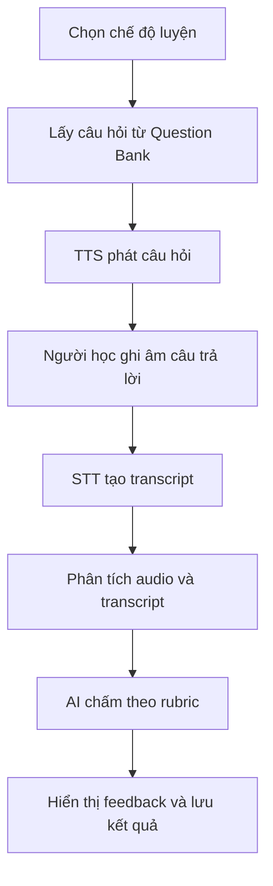

# Speakora — AI-powered English Speaking Practice

## 1. Tổng quan đề tài

Speakora là hệ thống luyện nói tiếng Anh ứng dụng AI, hỗ trợ người học luyện tập theo ba chế độ: **IELTS Speaking**, **TOEIC Speaking** và **General English**.

Hệ thống sử dụng ngân hàng câu hỏi đã được xây dựng và kiểm duyệt thay vì để AI tự sinh toàn bộ nội dung trong lúc luyện. Khi người học trả lời bằng giọng nói, hệ thống chuyển audio thành văn bản, phân tích một số đặc trưng của bài nói và sử dụng AI để chấm điểm, nhận xét theo rubric phù hợp với từng chế độ.

Tên repository dự kiến: `Speakora-AI-powered-English-Speaking-Practice`.

## 2. Lý do chọn đề tài

Kỹ năng nói cần được luyện tập thường xuyên, nhưng người học không phải lúc nào cũng có giáo viên hoặc bạn học để thực hành và nhận phản hồi. Việc tự ghi âm chỉ giúp nghe lại câu trả lời, chưa chỉ ra rõ lỗi về nội dung, ngữ pháp, từ vựng, độ trôi chảy hoặc cách cải thiện.

Speakora được đề xuất nhằm tạo ra một môi trường luyện nói có thể sử dụng bất cứ lúc nào. Người học được luyện theo cấu trúc bài thi hoặc tình huống thực tế, nhận kết quả ngay sau mỗi câu trả lời và theo dõi sự tiến bộ qua nhiều lần luyện tập.

## 3. Bài toán cần giải quyết

Hệ thống tập trung giải quyết các vấn đề sau:

- Người học thiếu môi trường luyện nói tiếng Anh thường xuyên.
- Khó tự đánh giá chất lượng câu trả lời khi luyện một mình.
- Phản hồi từ các công cụ thông thường thường chung chung, chưa bám sát dạng bài và rubric.
- Nội dung luyện tập trên Internet phân tán, chất lượng không đồng đều.
- Người học khó theo dõi lỗi lặp lại và mức độ tiến bộ theo thời gian.

## 4. Đối tượng sử dụng

### 4.1. Người học

- Sinh viên và người đi làm muốn cải thiện kỹ năng giao tiếp tiếng Anh.
- Người đang ôn IELTS Speaking.
- Người đang ôn TOEIC Speaking.
- Người muốn luyện hội thoại theo chủ đề và tình huống thực tế.

### 4.2. Quản trị viên

- Quản lý ngân hàng câu hỏi, chủ đề và rubric.
- Theo dõi nội dung đang được sử dụng trong hệ thống.
- Thêm, sửa, ẩn hoặc kích hoạt câu hỏi luyện tập.

## 5. Mục tiêu hệ thống

### 5.1. Mục tiêu tổng quát

Xây dựng hệ thống web hỗ trợ luyện nói tiếng Anh có cấu trúc, sử dụng công nghệ xử lý giọng nói và AI để cung cấp phản hồi cá nhân hóa sau mỗi lần luyện tập.

### 5.2. Mục tiêu cụ thể

- Cung cấp ba chế độ luyện: IELTS Speaking, TOEIC Speaking và General English.
- Sử dụng ngân hàng câu hỏi đã kiểm duyệt để bảo đảm nội dung ổn định.
- Phát câu hỏi bằng giọng nói qua Text-to-Speech (TTS).
- Cho phép người học ghi âm và nghe lại câu trả lời.
- Chuyển câu trả lời thành transcript bằng Speech-to-Text (STT).
- Phân tích các chỉ số như thời lượng, tốc độ nói và khoảng ngừng khi dữ liệu cho phép.
- Chấm và nhận xét theo rubric riêng của từng chế độ.
- Chỉ ra điểm mạnh, lỗi cần cải thiện và gợi ý cách trả lời tốt hơn.
- Lưu kết quả để người học theo dõi tiến bộ.

## 6. Phạm vi nội dung luyện tập

### 6.1. IELTS Speaking

- Luyện riêng Part 1, Part 2 và Part 3.
- Mock Test mô phỏng một bài IELTS Speaking hoàn chỉnh.
- Chấm theo các nhóm tiêu chí phù hợp như fluency and coherence, lexical resource, grammatical range and accuracy, pronunciation.

### 6.2. TOEIC Speaking

- Luyện theo từng dạng câu hỏi trong TOEIC Speaking.
- Mock Test theo cấu trúc bài thi.
- Câu hỏi, thời gian chuẩn bị, thời gian trả lời và rubric được cấu hình theo từng dạng bài.

### 6.3. General English

- Luyện hội thoại theo chủ đề và tình huống thực tế.
- Nội dung được phân loại theo trình độ hoặc độ khó.
- Phản hồi tập trung vào khả năng diễn đạt, tính phù hợp với tình huống, từ vựng, ngữ pháp và độ trôi chảy.

## 7. Luồng hoạt động tổng quát

## 8. Phạm vi MVP

Phiên bản MVP tập trung vào luồng giá trị cốt lõi:

> Chọn chế độ luyện → nhận câu hỏi → nghe TTS → ghi âm → STT tạo transcript → AI chấm và phản hồi → lưu kết quả.

MVP dự kiến gồm:

- Đăng ký, đăng nhập và hồ sơ học tập cơ bản.
- Chọn một trong ba chế độ luyện.
- Luyện theo Part hoặc dạng câu hỏi.
- Lấy câu hỏi từ ngân hàng đề.
- TTS phát câu hỏi.
- Ghi âm, nghe lại và gửi câu trả lời.
- STT tạo transcript và cho phép người học xem transcript.
- Chấm điểm, giải thích điểm và đưa ra gợi ý cải thiện.
- Lưu lịch sử các lượt luyện và xem lại kết quả.
- Chức năng quản trị cơ bản cho ngân hàng câu hỏi.

Mock Test có thể được triển khai sau khi luồng luyện một câu hoặc một dạng bài đã hoạt động ổn định.

## 9. Ngoài phạm vi MVP

Các chức năng sau được xem là hướng mở rộng, không bắt buộc trong phiên bản đầu:

- Khảo sát sở thích và mục tiêu học tập chuyên sâu.
- Lộ trình học cá nhân hóa tự động.
- Hội thoại AI thời gian thực.
- Gamification, huy hiệu, chuỗi ngày học và bảng xếp hạng.
- Mạng xã hội hoặc ghép cặp người học.
- Giáo viên chấm bài trực tiếp trên hệ thống.
- Ứng dụng mobile riêng.

## 10. Điểm khác biệt của Speakora

- Kết hợp luyện thi IELTS, TOEIC Speaking và giao tiếp thực tế trong cùng hệ thống.
- Câu hỏi đến từ ngân hàng nội dung đã kiểm duyệt, giúp kết quả luyện ổn định và có thể đánh giá lại.
- Rubric và cách phản hồi thay đổi theo chế độ, không dùng một prompt chung cho mọi bài nói.
- Kết hợp dữ liệu audio, transcript và các chỉ số định lượng thay vì chỉ gửi transcript cho AI.
- Lưu lịch sử để chỉ ra lỗi lặp lại và sự tiến bộ của từng người học.

## 11. Công nghệ dự kiến

| Thành phần | Công nghệ dự kiến |
| --- | --- |
| Frontend | Next.js |
| Backend API | FastAPI |
| Cơ sở dữ liệu | PostgreSQL / Supabase |
| Lưu trữ audio | Supabase Storage hoặc S3-compatible storage |
| Speech-to-Text | `gpt-4o-mini-transcribe` |
| Text-to-Speech | `gpt-4o-mini-tts` |
| AI đánh giá | LLM với đầu ra có cấu trúc theo JSON Schema |

Các công nghệ trên là phương án dự kiến và có thể được điều chỉnh sau bước thử nghiệm chất lượng, độ trễ và chi phí.

## 12. Kết quả mong đợi

- Một hệ thống web có thể chạy được toàn bộ luồng luyện nói cốt lõi.
- Ngân hàng câu hỏi có cấu trúc cho ba chế độ luyện.
- Kết quả chấm có điểm số, nhận xét, bằng chứng từ câu trả lời và đề xuất cải thiện.
- Lịch sử luyện tập giúp người học quan sát tiến bộ.
- Bộ dữ liệu và kịch bản đánh giá độ chính xác STT, độ ổn định của AI, thời gian phản hồi và chi phí mỗi lượt luyện.

## 13. Tiêu chí thành công ban đầu

- Người dùng hoàn thành được một lượt luyện từ lúc chọn câu hỏi đến khi nhận feedback mà không cần thao tác ngoài hệ thống.
- Transcript đủ chính xác để phục vụ việc chấm nội dung trong phần lớn tình huống thử nghiệm.
- Feedback bám sát rubric, chỉ ra được điểm mạnh và lỗi cụ thể trong câu trả lời.
- Kết quả chấm có cấu trúc nhất quán và có thể lưu vào cơ sở dữ liệu.
- Thời gian phản hồi và chi phí phù hợp với một sản phẩm phục vụ luyện tập thường xuyên.
