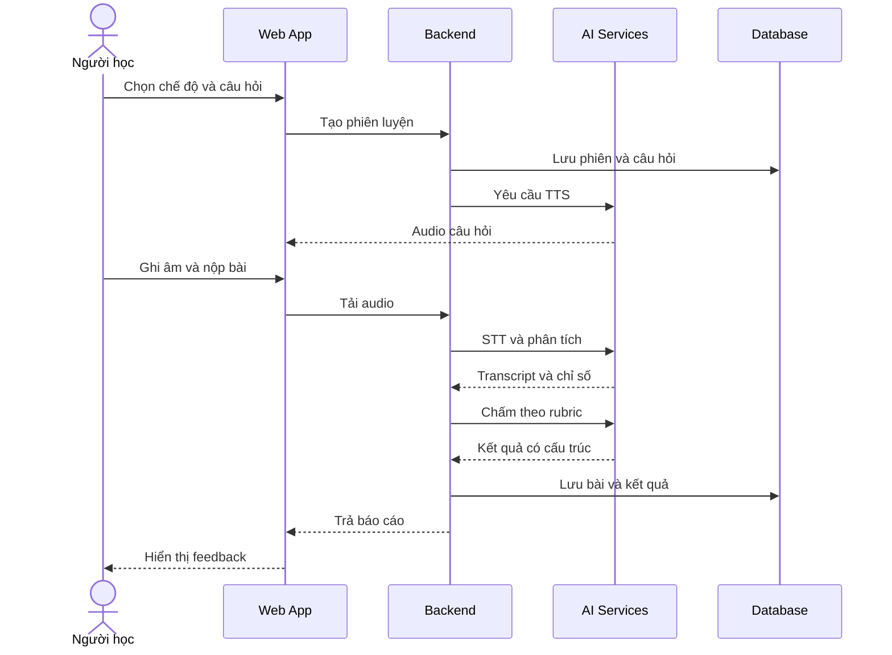

# Speakora — Functional Requirements

## 1. Mục đích tài liệu

Tài liệu này mô tả các yêu cầu chức năng của hệ thống Speakora. Các chức năng được chia thành hai mức ưu tiên:

- **MVP:** cần có để hoàn thành luồng luyện nói cốt lõi.
- **Mở rộng:** triển khai sau khi MVP hoạt động ổn định.

## 2. Tác nhân hệ thống

| Tác nhân | Mô tả |
| --- | --- |
| Khách | Người chưa đăng nhập, có thể xem giới thiệu và tạo tài khoản. |
| Người học | Chọn nội dung, luyện nói, nhận feedback và theo dõi lịch sử. |
| Quản trị viên | Quản lý câu hỏi, chủ đề, rubric và trạng thái nội dung. |
| Dịch vụ AI | Thực hiện STT, TTS và đánh giá câu trả lời theo yêu cầu từ backend. |

## 3. Quy tắc nghiệp vụ chung

- Câu hỏi luyện tập phải được lấy từ ngân hàng câu hỏi đang ở trạng thái hoạt động.
- Mỗi câu hỏi phải thuộc đúng một chế độ và một dạng bài cụ thể.
- Cấu hình thời gian chuẩn bị, thời gian trả lời và rubric phụ thuộc vào dạng câu hỏi.
- Chỉ chấm bài sau khi audio đã được tải lên thành công và lượt trả lời hợp lệ.
- Kết quả do AI trả về phải đúng cấu trúc dữ liệu mà hệ thống quy định trước khi được lưu.
- Điểm phát âm không được suy ra chỉ từ transcript; phải dùng audio hoặc dữ liệu phân tích giọng nói phù hợp.
- Khi STT có độ tin cậy thấp hoặc audio không đủ chất lượng, kết quả phải hiển thị cảnh báo thay vì khẳng định chắc chắn.
- Một lần gọi AI lỗi không được làm mất audio hoặc dữ liệu của lượt luyện; hệ thống phải cho phép thử xử lý lại.

## 4. Yêu cầu chức năng MVP

### 4.1. Tài khoản và hồ sơ

#### FR-AUTH-01 — Đăng ký tài khoản

- **Tác nhân:** Khách.
- **Mô tả:** Người dùng tạo tài khoản bằng các thông tin đăng ký được hệ thống hỗ trợ.
- **Kết quả:** Tài khoản được tạo và người dùng có thể đăng nhập.

#### FR-AUTH-02 — Đăng nhập và đăng xuất

- **Tác nhân:** Khách, Người học, Quản trị viên.
- **Mô tả:** Người dùng đăng nhập để truy cập dữ liệu cá nhân và đăng xuất khi kết thúc phiên.
- **Kết quả:** Hệ thống tạo hoặc hủy phiên đăng nhập phù hợp.

#### FR-PROFILE-01 — Quản lý hồ sơ cơ bản

- **Tác nhân:** Người học.
- **Mô tả:** Người học xem và cập nhật tên hiển thị, mục tiêu luyện tập và trình độ tự đánh giá.
- **Kết quả:** Thông tin mới được lưu và sử dụng để đề xuất nội dung phù hợp ở mức cơ bản.

### 4.2. Chọn chế độ và nội dung luyện

#### FR-PRACTICE-01 — Chọn chế độ luyện

- **Tác nhân:** Người học.
- **Mô tả:** Người học chọn IELTS Speaking, TOEIC Speaking hoặc General English.
- **Kết quả:** Hệ thống hiển thị các Part, dạng câu hỏi, chủ đề hoặc cấp độ tương ứng.

#### FR-PRACTICE-02 — Chọn dạng bài

- **Tác nhân:** Người học.
- **Mô tả:** Người học chọn Part của IELTS, dạng câu hỏi TOEIC Speaking hoặc chủ đề General English.
- **Kết quả:** Hệ thống tạo một phiên luyện với cấu hình phù hợp.

#### FR-PRACTICE-03 — Lấy câu hỏi từ ngân hàng đề

- **Tác nhân:** Người học.
- **Mô tả:** Hệ thống lấy câu hỏi đang hoạt động, phù hợp với chế độ, dạng bài và độ khó đã chọn.
- **Kết quả:** Câu hỏi và cấu hình liên quan được gắn với phiên luyện.

#### FR-PRACTICE-04 — Hiển thị hướng dẫn và thời gian

- **Tác nhân:** Người học.
- **Mô tả:** Hệ thống hiển thị nội dung câu hỏi, hướng dẫn, thời gian chuẩn bị và thời gian trả lời nếu dạng bài yêu cầu.
- **Kết quả:** Người học biết rõ cách thực hiện trước khi ghi âm.

### 4.3. Phát câu hỏi bằng TTS

#### FR-TTS-01 — Tạo audio câu hỏi

- **Tác nhân:** Người học, Dịch vụ AI.
- **Mô tả:** Hệ thống chuyển nội dung câu hỏi thành giọng nói tiếng Anh hoặc sử dụng audio đã tạo sẵn.
- **Kết quả:** Audio câu hỏi có thể phát trên giao diện.

#### FR-TTS-02 — Điều khiển phát audio

- **Tác nhân:** Người học.
- **Mô tả:** Người học có thể phát, tạm dừng và nghe lại câu hỏi theo giới hạn của chế độ luyện.
- **Kết quả:** Trạng thái phát được hiển thị rõ ràng.

### 4.4. Ghi âm và nộp câu trả lời

#### FR-AUDIO-01 — Xin quyền sử dụng microphone

- **Tác nhân:** Người học.
- **Mô tả:** Hệ thống yêu cầu quyền microphone và thông báo rõ nếu quyền bị từ chối hoặc thiết bị không khả dụng.
- **Kết quả:** Microphone sẵn sàng trước khi ghi âm.

#### FR-AUDIO-02 — Ghi âm câu trả lời

- **Tác nhân:** Người học.
- **Mô tả:** Người học bắt đầu và kết thúc ghi âm; hệ thống hiển thị thời lượng và tuân thủ giới hạn của dạng bài.
- **Kết quả:** Một tệp audio hợp lệ được tạo.

#### FR-AUDIO-03 — Nghe lại và ghi lại

- **Tác nhân:** Người học.
- **Mô tả:** Trong chế độ luyện thông thường, người học có thể nghe lại hoặc ghi lại trước khi nộp. Mock Test có thể tắt quyền này.
- **Kết quả:** Chỉ phiên bản audio được xác nhận mới được nộp.

#### FR-AUDIO-04 — Tải và lưu audio

- **Tác nhân:** Người học.
- **Mô tả:** Hệ thống tải audio lên vùng lưu trữ, liên kết với phiên luyện và không tạo bài chấm trùng khi người dùng gửi lại yêu cầu.
- **Kết quả:** Audio được lưu thành công và sẵn sàng xử lý.

### 4.5. Speech-to-Text

#### FR-STT-01 — Chuyển audio thành transcript

- **Tác nhân:** Dịch vụ AI.
- **Mô tả:** Backend gửi audio tới dịch vụ STT với ngôn ngữ tiếng Anh.
- **Kết quả:** Transcript và metadata khả dụng được trả về.

#### FR-STT-02 — Hiển thị transcript

- **Tác nhân:** Người học.
- **Mô tả:** Hệ thống hiển thị transcript sau khi nhận kết quả STT.
- **Kết quả:** Người học có thể đối chiếu nội dung đã nói với văn bản nhận dạng.

#### FR-STT-03 — Xử lý transcript không đáng tin cậy

- **Tác nhân:** Người học.
- **Mô tả:** Nếu audio quá ngắn, quá nhiễu, không có tiếng nói hoặc STT thất bại, hệ thống hiển thị lý do và cho phép ghi lại hoặc xử lý lại.
- **Kết quả:** Không tạo kết quả chấm gây hiểu nhầm từ dữ liệu không hợp lệ.

### 4.6. Phân tích bài nói

#### FR-ANALYSIS-01 — Tính chỉ số định lượng

- **Tác nhân:** Dịch vụ AI, Hệ thống.
- **Mô tả:** Hệ thống tính các chỉ số khả dụng như thời lượng, số từ, tốc độ nói và khoảng ngừng.
- **Kết quả:** Các chỉ số được lưu cùng bài trả lời và cung cấp cho bước đánh giá.

#### FR-ANALYSIS-02 — Chuẩn bị dữ liệu chấm

- **Tác nhân:** Hệ thống.
- **Mô tả:** Hệ thống kết hợp câu hỏi, dạng bài, rubric, transcript, chỉ số audio và ngữ cảnh cần thiết thành input đánh giá.
- **Kết quả:** Dữ liệu đầu vào đầy đủ, đúng rubric và không trộn lẫn giữa các chế độ.

### 4.7. AI chấm điểm và phản hồi

#### FR-ASSESS-01 — Chọn rubric phù hợp

- **Tác nhân:** Hệ thống.
- **Mô tả:** Hệ thống chọn rubric theo IELTS, TOEIC Speaking hoặc General English và theo dạng câu hỏi cụ thể.
- **Kết quả:** Bài trả lời được đánh giá bằng đúng bộ tiêu chí.

#### FR-ASSESS-02 — Tạo kết quả chấm có cấu trúc

- **Tác nhân:** Dịch vụ AI.
- **Mô tả:** AI trả kết quả theo JSON Schema, gồm điểm tổng, điểm theo tiêu chí, nhận xét và đề xuất cải thiện.
- **Kết quả:** Backend kiểm tra cấu trúc trước khi lưu.

#### FR-ASSESS-03 — Cung cấp bằng chứng cho nhận xét

- **Tác nhân:** Dịch vụ AI.
- **Mô tả:** Với nhận xét về nội dung, từ vựng hoặc ngữ pháp, hệ thống trích đoạn liên quan từ transcript và giải thích vấn đề.
- **Kết quả:** Người học hiểu nhận xét dựa trên phần nào trong câu trả lời.

#### FR-ASSESS-04 — Gợi ý cải thiện

- **Tác nhân:** Dịch vụ AI.
- **Mô tả:** Hệ thống đưa ra các đề xuất cụ thể, có thể kèm câu sửa hoặc câu trả lời tham khảo phù hợp với trình độ.
- **Kết quả:** Người học có hành động rõ ràng cho lần luyện tiếp theo.

#### FR-ASSESS-05 — Xử lý lỗi đánh giá

- **Tác nhân:** Hệ thống.
- **Mô tả:** Nếu dịch vụ AI lỗi, timeout hoặc trả sai schema, hệ thống lưu trạng thái thất bại và cho phép xử lý lại mà không yêu cầu ghi âm lại.
- **Kết quả:** Dữ liệu người dùng không bị mất và không sinh nhiều kết quả trùng.

### 4.8. Hiển thị kết quả

#### FR-RESULT-01 — Xem kết quả chi tiết

- **Tác nhân:** Người học.
- **Mô tả:** Trang kết quả hiển thị câu hỏi, audio, transcript, điểm tổng, điểm theo tiêu chí, điểm mạnh, lỗi và đề xuất cải thiện.
- **Kết quả:** Người học xem được toàn bộ kết quả của lượt luyện.

#### FR-RESULT-02 — Phân biệt dữ liệu đo và nhận xét AI

- **Tác nhân:** Người học.
- **Mô tả:** Giao diện phân biệt các chỉ số được đo trực tiếp với các nhận xét do AI suy luận.
- **Kết quả:** Người học hiểu đúng mức độ tin cậy của từng loại thông tin.

### 4.9. Lịch sử và tiến bộ

#### FR-HISTORY-01 — Lưu lịch sử luyện tập

- **Tác nhân:** Hệ thống.
- **Mô tả:** Sau khi xử lý, hệ thống lưu phiên luyện, câu hỏi, audio, transcript, chỉ số và kết quả chấm.
- **Kết quả:** Dữ liệu được liên kết đúng với người học.

#### FR-HISTORY-02 — Xem danh sách lượt luyện

- **Tác nhân:** Người học.
- **Mô tả:** Người học xem các lượt luyện theo thời gian và lọc theo chế độ.
- **Kết quả:** Có thể mở lại từng kết quả chi tiết.

#### FR-PROGRESS-01 — Xem tiến bộ cơ bản

- **Tác nhân:** Người học.
- **Mô tả:** Hệ thống tổng hợp điểm và một số chỉ số theo thời gian cho từng chế độ.
- **Kết quả:** Người học nhận biết xu hướng cải thiện và tiêu chí còn yếu.

### 4.10. Quản lý ngân hàng câu hỏi

#### FR-ADMIN-01 — Thêm và sửa câu hỏi

- **Tác nhân:** Quản trị viên.
- **Mô tả:** Quản trị viên nhập nội dung, chế độ, dạng bài, chủ đề, độ khó, thời gian và hướng dẫn.
- **Kết quả:** Câu hỏi được lưu với trạng thái phù hợp.

#### FR-ADMIN-02 — Kích hoạt hoặc ẩn câu hỏi

- **Tác nhân:** Quản trị viên.
- **Mô tả:** Quản trị viên thay đổi trạng thái câu hỏi mà không cần xóa dữ liệu lịch sử.
- **Kết quả:** Chỉ câu hỏi đang hoạt động được cấp cho lượt luyện mới.

#### FR-ADMIN-03 — Quản lý rubric

- **Tác nhân:** Quản trị viên.
- **Mô tả:** Quản trị viên cấu hình rubric và phiên bản rubric cho từng chế độ hoặc dạng câu hỏi.
- **Kết quả:** Mỗi kết quả chấm lưu lại phiên bản rubric đã sử dụng.

## 5. Yêu cầu cho Mock Test

Mock Test có thể được triển khai ở cuối MVP hoặc giai đoạn kế tiếp.

#### FR-MOCK-01 — Bắt đầu Mock Test

- **Tác nhân:** Người học.
- **Mô tả:** Hệ thống tạo bài gồm nhiều câu theo cấu trúc IELTS hoặc TOEIC Speaking đã cấu hình.
- **Kết quả:** Thứ tự câu hỏi và giới hạn thời gian được cố định cho lần thi thử.

#### FR-MOCK-02 — Điều phối bài thi

- **Tác nhân:** Hệ thống.
- **Mô tả:** Hệ thống tự chuyển qua các bước chuẩn bị, phát câu hỏi, ghi âm và sang câu tiếp theo.
- **Kết quả:** Trải nghiệm gần với cấu trúc bài thi và hạn chế thao tác ngoài quy định.

#### FR-MOCK-03 — Tổng hợp kết quả

- **Tác nhân:** Hệ thống, Dịch vụ AI.
- **Mô tả:** Hệ thống chấm từng câu và tổng hợp thành báo cáo toàn bài theo quy tắc của chế độ.
- **Kết quả:** Người học xem điểm tổng, điểm thành phần và nhận xét chung.

## 6. Chức năng mở rộng

| Mã | Chức năng | Mô tả ngắn |
| --- | --- | --- |
| FR-EXT-01 | Khảo sát đầu vào | Thu thập mục tiêu, sở thích, trình độ và thời gian học. |
| FR-EXT-02 | Lộ trình cá nhân hóa | Đề xuất nội dung dựa trên lịch sử và lỗi lặp lại. |
| FR-EXT-03 | Hội thoại thời gian thực | AI trò chuyện và đặt câu hỏi tiếp theo theo ngữ cảnh. |
| FR-EXT-04 | Bài tập khắc phục lỗi | Tạo hoặc chọn bài luyện tập trung vào điểm yếu đã phát hiện. |
| FR-EXT-05 | Gamification | Chuỗi ngày học, huy hiệu, mục tiêu tuần và điểm kinh nghiệm. |
| FR-EXT-06 | Dashboard quản trị | Thống kê số người học, lượt luyện, lỗi dịch vụ và chi phí. |
| FR-EXT-07 | Giáo viên phản hồi | Giáo viên xem bài và bổ sung nhận xét cho người học. |

## 7. Luồng chức năng cốt lõi

## 8. Điều kiện hoàn thành MVP

MVP được xem là hoàn thành về mặt chức năng khi:

- Người dùng có thể đăng nhập và chọn một chế độ luyện.
- Hệ thống lấy đúng câu hỏi từ ngân hàng đề và phát được bằng TTS.
- Người dùng ghi âm, nghe lại và nộp được câu trả lời.
- Hệ thống tạo transcript, xử lý được các trường hợp audio lỗi phổ biến và không làm mất bài.
- Hệ thống chấm đúng rubric, kiểm tra được JSON đầu ra và hiển thị feedback cụ thể.
- Kết quả được lưu, xem lại trong lịch sử và tổng hợp tiến bộ cơ bản.
- Quản trị viên có thể thêm, sửa và thay đổi trạng thái câu hỏi.
