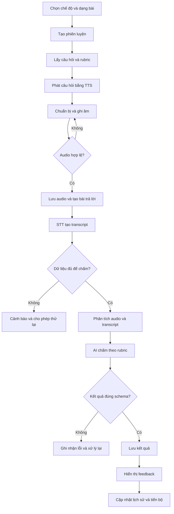
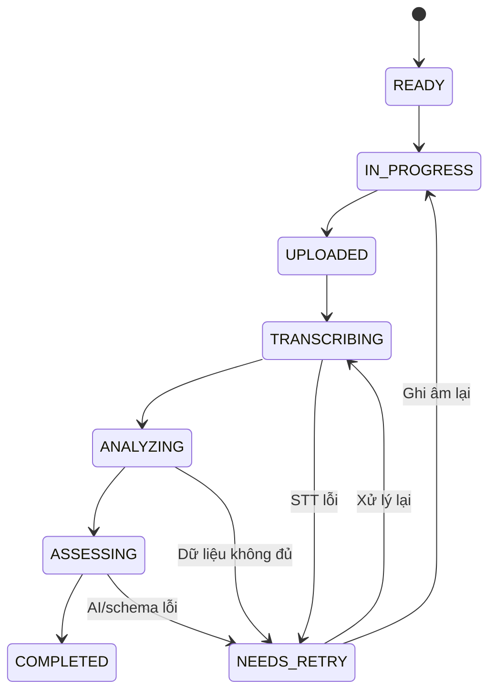

# Speakora — Main Pipeline

## 1. Mục đích tài liệu

Tài liệu mô tả pipeline hoạt động chính của Speakora, từ khi người học chọn nội dung đến khi nhận kết quả và xem lại lịch sử. Pipeline áp dụng cho ba chế độ: **IELTS Speaking**, **TOEIC Speaking** và **General English**.

Mục tiêu của pipeline là:

- bảo đảm mỗi bài trả lời được xử lý bằng đúng cấu hình và rubric;
- không làm mất audio khi STT hoặc AI gặp lỗi;
- phân biệt dữ liệu đo trực tiếp với nhận xét do AI suy luận;
- cho phép xử lý lại từng bước mà không tạo kết quả trùng;
- cung cấp trạng thái xử lý rõ ràng cho giao diện.

## 2. Input và output

### 2.1. Input của một lượt luyện

| Nhóm dữ liệu | Nội dung |
| --- | --- |
| Người học | `user_id`, mục tiêu và trình độ cơ bản |
| Chế độ | `IELTS`, `TOEIC_SPEAKING` hoặc `GENERAL_ENGLISH` |
| Nội dung | Part, dạng câu hỏi, chủ đề, độ khó |
| Câu hỏi | Nội dung, hướng dẫn, thời gian chuẩn bị, thời gian trả lời |
| Câu trả lời | Tệp audio do người học ghi âm |
| Cấu hình chấm | Rubric và phiên bản rubric tương ứng |

### 2.2. Output của một lượt luyện

- audio câu trả lời và transcript;
- trạng thái và cảnh báo chất lượng audio/STT;
- các chỉ số định lượng như thời lượng, số từ, tốc độ nói và khoảng ngừng;
- điểm tổng và điểm theo từng tiêu chí;
- điểm mạnh, lỗi cụ thể, bằng chứng từ transcript;
- gợi ý cải thiện và câu trả lời tham khảo nếu phù hợp;
- thông tin để tổng hợp lịch sử và tiến bộ.

## 3. Pipeline tổng quát

## 4. Mô tả chi tiết từng giai đoạn

### Giai đoạn 1 — Chọn nội dung luyện tập

1. Người học chọn một trong ba chế độ.
2. Hệ thống hiển thị cấu trúc tương ứng:
   - IELTS Speaking: Part 1, Part 2 hoặc Part 3;
   - TOEIC Speaking: dạng câu hỏi cụ thể;
   - General English: chủ đề, tình huống và độ khó.
3. Backend kiểm tra lựa chọn hợp lệ và tạo `practice_session`.
4. Hệ thống lấy một câu hỏi đang hoạt động từ Question Bank.
5. Phiên bản nội dung và `rubric_version` được gắn cố định với phiên luyện để kết quả cũ không thay đổi khi quản trị viên sửa rubric sau này.

**Output:** phiên luyện ở trạng thái `READY`, có câu hỏi và cấu hình thời gian.

### Giai đoạn 2 — Chuẩn bị và phát câu hỏi

1. Backend kiểm tra câu hỏi đã có audio TTS hay chưa.
2. Nếu đã có, hệ thống trả URL audio đang lưu trữ.
3. Nếu chưa có, backend gọi dịch vụ TTS, lưu tệp kết quả và tái sử dụng cho các lượt sau.
4. Giao diện hiển thị nội dung, hướng dẫn và điều khiển phát audio.
5. Nếu dạng bài có thời gian chuẩn bị, bộ đếm bắt đầu theo cấu hình.

Việc lưu sẵn audio TTS giúp giảm độ trễ và chi phí vì cùng một câu hỏi không cần được tổng hợp giọng nói ở mọi lượt luyện.

**Output:** câu hỏi sẵn sàng để nghe; phiên ở trạng thái `IN_PROGRESS`.

### Giai đoạn 3 — Ghi âm và kiểm tra phía client

1. Trình duyệt xin quyền microphone.
2. Người học bắt đầu và kết thúc ghi âm trong giới hạn thời gian.
3. Giao diện kiểm tra sơ bộ:
   - có tạo được tệp audio;
   - định dạng và dung lượng được hỗ trợ;
   - thời lượng không bằng 0 và không vượt giới hạn;
   - thiết bị không bị ngắt giữa chừng.
4. Trong chế độ luyện thông thường, người học có thể nghe lại hoặc ghi lại trước khi nộp.

Kiểm tra phía client chỉ nhằm phản hồi nhanh. Backend vẫn phải kiểm tra lại vì dữ liệu từ client không được xem là đáng tin cậy tuyệt đối.

**Output:** một tệp audio tạm thời sẵn sàng tải lên.

### Giai đoạn 4 — Lưu audio và tạo bài trả lời

1. Client yêu cầu backend cấp thông tin tải tệp.
2. Audio được tải lên vùng lưu trữ.
3. Backend xác nhận tệp tồn tại và kiểm tra metadata cơ bản.
4. Hệ thống tạo `user_answer`, liên kết với `user_id`, `session_id` và `question_id`.
5. Mỗi lần nộp sử dụng một `idempotency_key`. Nếu client gửi lại do mất mạng, backend trả bản ghi cũ thay vì tạo bài trả lời trùng.
6. Sau khi audio đã được lưu an toàn, backend tạo tác vụ xử lý nền.

**Output:** bài trả lời ở trạng thái `UPLOADED`; audio không phụ thuộc vào sự thành công của STT hay AI.

### Giai đoạn 5 — STT và kiểm tra khả năng sử dụng

1. Worker nhận tác vụ và đặt trạng thái `TRANSCRIBING`.
2. Audio được gửi tới STT với ngôn ngữ `en`.
3. Hệ thống lưu transcript và metadata do dịch vụ trả về.
4. Backend thực hiện các kiểm tra tối thiểu:
   - audio có tiếng nói hay không;
   - thời lượng có quá ngắn không;
   - transcript có rỗng hoặc quá ít từ không;
   - dịch vụ có trả lỗi hoặc timeout không.
5. Nếu dữ liệu không đủ để chấm, trạng thái chuyển thành `NEEDS_RETRY` và giao diện hiển thị lý do.

Không tự động sửa transcript bằng LLM trước khi chấm vì việc sửa có thể biến câu người học thực sự nói thành một câu đúng hơn và làm sai lệch kết quả đánh giá.

**Output:** transcript hợp lệ hoặc lỗi có thể xử lý lại.

### Giai đoạn 6 — Phân tích audio và transcript

Hệ thống tạo các chỉ số định lượng có thể đo được:

- thời lượng audio;
- số từ trong transcript;
- tốc độ nói ước tính theo từ/phút;
- số lượng và tổng thời gian khoảng ngừng nếu bộ phân tích hỗ trợ timestamp;
- tỷ lệ thời gian có tiếng nói;
- các cảnh báo như audio quá nhỏ, nhiều nhiễu hoặc bị cắt.

Các chỉ số này được lưu riêng với đánh giá của LLM. Điểm phát âm chỉ được cung cấp khi có dữ liệu audio hoặc mô hình đánh giá phát âm phù hợp; không suy ra phát âm chỉ từ transcript.

**Output:** `speech_metrics`, `quality_flags` và dữ liệu đầu vào cho bước chấm.

### Giai đoạn 7 — Chuẩn bị assessment context

Backend kết hợp:

- câu hỏi và hướng dẫn;
- chế độ và dạng bài;
- transcript gốc;
- các chỉ số audio;
- rubric cùng phiên bản;
- thang điểm và JSON Schema cần trả về.

Backend chỉ đưa vào các dữ liệu cần thiết cho một lượt chấm, không gửi toàn bộ hồ sơ hoặc lịch sử không liên quan của người học.

**Output:** một assessment payload thống nhất và có thể truy vết.

### Giai đoạn 8 — AI chấm và tạo feedback

1. Worker đặt trạng thái `ASSESSING`.
2. LLM đánh giá theo rubric của đúng chế độ và dạng bài.
3. Kết quả phải gồm tối thiểu:
   - điểm tổng;
   - điểm theo tiêu chí;
   - điểm mạnh;
   - lỗi cần cải thiện;
   - đoạn transcript làm bằng chứng cho lỗi ngữ pháp, từ vựng hoặc nội dung;
   - hành động cải thiện cụ thể.
4. Với dữ liệu không đủ, AI phải ghi rõ giới hạn thay vì tự đoán.
5. Backend kiểm tra JSON Schema, phạm vi điểm, tiêu chí bắt buộc và tính nhất quán cơ bản.

**Output:** kết quả hợp lệ hoặc lỗi cần chạy lại.

### Giai đoạn 9 — Lưu và trả kết quả

1. Khi kết quả hợp lệ, backend lưu `assessment_result` cùng model, prompt version và rubric version.
2. `user_answer` chuyển sang trạng thái `COMPLETED`.
3. Giao diện nhận trạng thái mới bằng polling ở MVP; WebSocket có thể bổ sung sau.
4. Trang kết quả hiển thị:
   - audio và transcript;
   - chỉ số được đo;
   - điểm và feedback AI;
   - cảnh báo chất lượng hoặc giới hạn đánh giá;
   - đề xuất cho lần luyện tiếp theo.
5. Dữ liệu được đưa vào phần lịch sử và tổng hợp tiến bộ.

## 5. Pipeline theo từng chế độ

| Nội dung | IELTS Speaking | TOEIC Speaking | General English |
| --- | --- | --- | --- |
| Đơn vị luyện | Part 1, 2, 3 | Dạng câu hỏi | Chủ đề/tình huống |
| Cấu hình thời gian | Theo từng Part | Theo từng dạng bài | Linh hoạt theo cấp độ |
| Trọng tâm chấm | Fluency, vocabulary, grammar, pronunciation | Task fulfillment, intelligibility, language use và tiêu chí theo dạng | Tính phù hợp, rõ ràng, từ vựng, ngữ pháp, độ trôi chảy |
| Ngữ cảnh bổ sung | Cue card hoặc câu hỏi liên quan | Hình ảnh/văn bản nếu dạng bài yêu cầu | Vai trò và tình huống hội thoại |
| Thang điểm | Chuẩn hóa theo cấu hình IELTS | Chuẩn hóa theo cấu hình TOEIC Speaking | Thang điểm nội bộ dễ hiểu |

Pipeline kỹ thuật giữ nguyên; chỉ thay đổi cấu hình câu hỏi, thời gian, dữ liệu đầu vào và rubric.

## 6. Trạng thái xử lý

| Trạng thái | Ý nghĩa |
| --- | --- |
| `READY` | Phiên đã có câu hỏi và cấu hình. |
| `IN_PROGRESS` | Người học đang chuẩn bị hoặc ghi âm. |
| `UPLOADED` | Audio đã được lưu thành công. |
| `TRANSCRIBING` | Đang chạy STT. |
| `ANALYZING` | Đang tính chỉ số và kiểm tra dữ liệu. |
| `ASSESSING` | Đang chấm theo rubric. |
| `COMPLETED` | Kết quả đã được lưu và có thể xem. |
| `NEEDS_RETRY` | Một bước thất bại hoặc dữ liệu chưa đủ; audio vẫn được giữ. |

## 7. Xử lý lỗi và retry

| Tình huống | Cách xử lý |
| --- | --- |
| Mất mạng khi tải audio | Client tiếp tục hoặc tải lại; `idempotency_key` ngăn tạo bài trùng. |
| Audio rỗng/không có tiếng nói | Không chấm; yêu cầu người học ghi lại. |
| STT timeout/lỗi tạm thời | Retry có giới hạn; sau đó chuyển `NEEDS_RETRY`. |
| Transcript quá ngắn/không đáng tin cậy | Hiển thị cảnh báo; không tạo kết quả khẳng định chắc chắn. |
| Phân tích chỉ số lỗi | Có thể tiếp tục chấm các tiêu chí còn đủ dữ liệu và ghi rõ phần bị thiếu. |
| LLM timeout | Retry có giới hạn mà không gọi lại STT. |
| LLM trả sai JSON Schema | Yêu cầu sửa về đúng schema hoặc gọi lại; chỉ lưu khi hợp lệ. |
| Người dùng đóng trang | Tác vụ nền tiếp tục; có thể xem lại trạng thái từ lịch sử. |

Mỗi bước phải có số lần thử tối đa và ghi nhận lỗi kỹ thuật. Không retry vô hạn vì có thể làm tăng chi phí và tạo nhiều kết quả khác nhau.

## 8. Dữ liệu cần lưu để truy vết

Đối với mỗi kết quả, hệ thống cần lưu:

- `answer_id`, `session_id`, `question_id`;
- URL hoặc khóa lưu trữ audio;
- transcript gốc và metadata STT;
- speech metrics và quality flags;
- chế độ, dạng bài và rubric version;
- model và prompt version dùng để đánh giá;
- kết quả JSON đã được kiểm tra;
- trạng thái, số lần retry, thời điểm tạo và hoàn thành.

Thông tin này giúp tái hiện một lượt chấm, so sánh phiên bản AI và đánh giá độ ổn định của hệ thống.

## 9. Pipeline Mock Test

Mock Test tái sử dụng pipeline của một câu trả lời nhưng có một lớp điều phối phía trên:

1. Tạo danh sách câu theo cấu trúc IELTS hoặc TOEIC Speaking.
2. Khóa thứ tự câu hỏi và cấu hình thời gian.
3. Tự động chuyển qua chuẩn bị → phát câu hỏi → ghi âm → nộp bài.
4. Mỗi câu tạo một `user_answer` riêng và được xử lý bằng pipeline chuẩn.
5. Khi tất cả câu hoàn thành, hệ thống tổng hợp thành báo cáo toàn bài.

Mock Test không nên được triển khai trước khi pipeline xử lý một câu hoạt động ổn định.

## 10. Điều kiện hoàn thành pipeline MVP

- Người học đi hết luồng từ chọn câu hỏi đến nhận feedback.
- Audio được lưu trước khi bắt đầu STT và không mất khi dịch vụ phía sau lỗi.
- Câu hỏi và rubric được chọn đúng theo chế độ, dạng bài.
- STT, chỉ số định lượng và nhận xét AI được lưu tách biệt.
- Chỉ kết quả đúng schema và đúng phạm vi điểm mới được công bố.
- Có thể xử lý lại từ bước lỗi mà không yêu cầu thực hiện lại toàn bộ pipeline.
- Giao diện hiển thị đúng trạng thái đang xử lý, hoàn thành hoặc cần thử lại.
