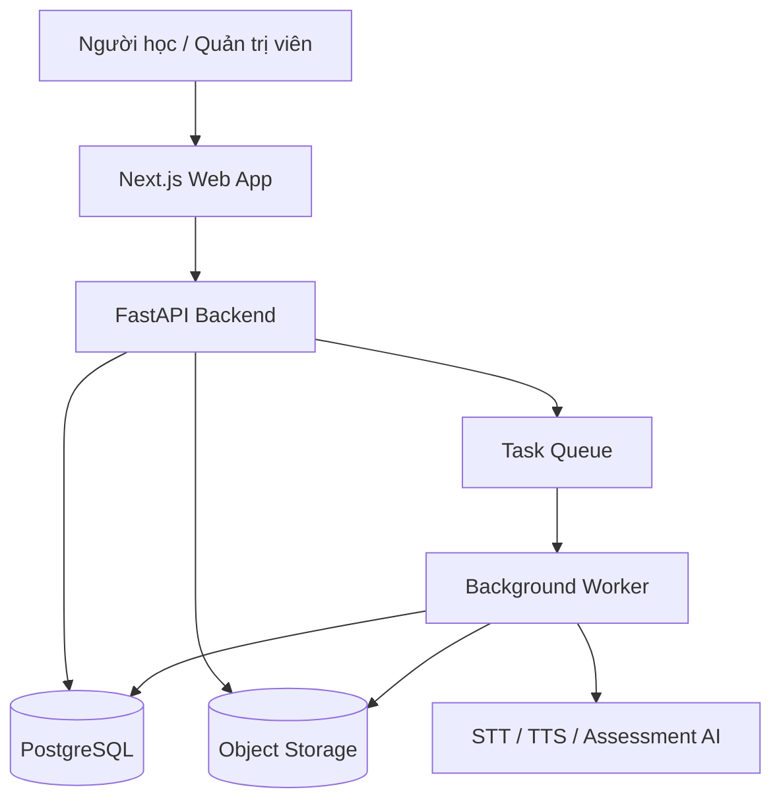
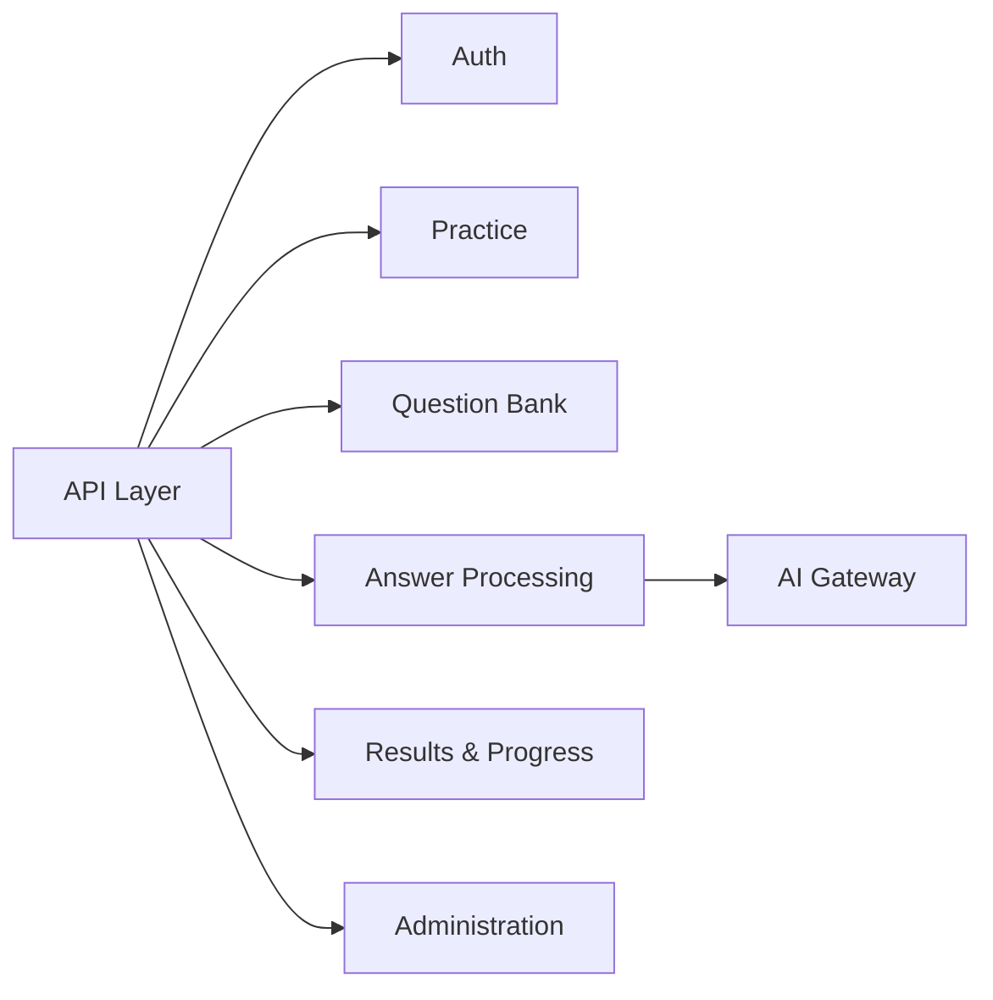
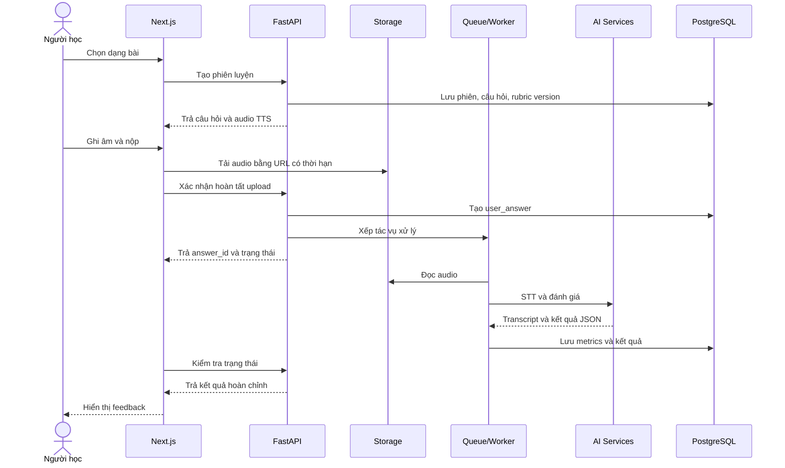
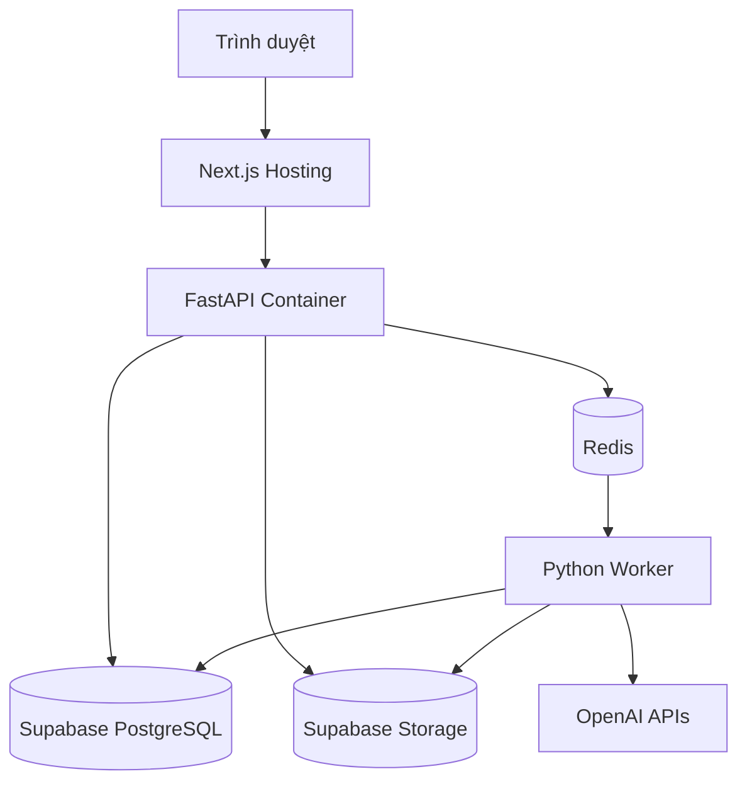

# Speakora — System Architecture

## 1. Mục đích tài liệu

Tài liệu mô tả kiến trúc kỹ thuật đề xuất cho Speakora trong phạm vi MVP. Kiến trúc ưu tiên dễ triển khai, đủ khả năng mở rộng và bảo đảm tác vụ STT/AI không làm chậm hoặc mất dữ liệu của luồng người dùng.

Speakora được triển khai theo kiến trúc **modular monolith kết hợp background worker**. Các nghiệp vụ vẫn nằm trong một backend FastAPI có phân chia module rõ ràng; chưa cần tách thành nhiều microservice ở giai đoạn đồ án.

## 2. Các thành phần chính

| Thành phần | Công nghệ dự kiến | Trách nhiệm |
| --- | --- | --- |
| Web Application | Next.js | Giao diện, xác thực, chọn bài, phát TTS, ghi âm, tải audio, hiển thị kết quả. |
| Backend API | FastAPI | Nghiệp vụ, kiểm tra quyền, quản lý phiên luyện, câu hỏi, bài trả lời và kết quả. |
| Background Worker | Python worker | Chạy STT, phân tích audio và gọi LLM ngoài request của người dùng. |
| Task Queue | Redis + Celery/RQ hoặc hàng đợi tương đương | Xếp hàng tác vụ, retry và tránh xử lý đồng bộ quá lâu. |
| Database | PostgreSQL / Supabase | Lưu tài khoản, nội dung, phiên luyện, transcript, chỉ số và kết quả. |
| Object Storage | Supabase Storage hoặc S3-compatible | Lưu audio câu hỏi TTS và audio câu trả lời. |
| STT Service | `gpt-4o-mini-transcribe` | Chuyển câu trả lời tiếng Anh thành transcript. |
| TTS Service | `gpt-4o-mini-tts` | Tạo audio cho câu hỏi chưa được tạo sẵn. |
| Assessment LLM | LLM có Structured Outputs | Chấm theo rubric và trả JSON có cấu trúc. |

## 3. Sơ đồ kiến trúc tổng thể

Frontend không gọi trực tiếp các dịch vụ AI. API key, prompt, rubric và logic kiểm tra kết quả được giữ ở backend/worker.

## 4. Kiến trúc logic của backend

| Module | Trách nhiệm chính |
| --- | --- |
| `auth` | Xác thực, phân quyền người học và quản trị viên. |
| `users` | Hồ sơ, mục tiêu và trình độ cơ bản. |
| `content` | Chế độ, Part/dạng bài, chủ đề, câu hỏi và trạng thái nội dung. |
| `practice` | Tạo phiên, chọn câu hỏi, cấu hình thời gian và Mock Test sau này. |
| `answers` | Tạo bài trả lời, xác nhận audio, trạng thái pipeline và retry. |
| `assessment` | Chọn rubric, tạo assessment payload, kiểm tra JSON Schema. |
| `results` | Trả kết quả chi tiết, lịch sử và dữ liệu tiến bộ. |
| `admin` | Quản lý Question Bank và các phiên bản rubric. |
| `ai_gateway` | Chuẩn hóa cách gọi STT, TTS, LLM; timeout, retry và logging. |

Các module có ranh giới rõ ràng nhưng cùng được triển khai trong một ứng dụng FastAPI. Khi tải tăng, `ai_gateway` và worker có thể tách riêng mà không phải viết lại toàn bộ nghiệp vụ.

## 5. Luồng giao tiếp chính

Trong MVP, frontend có thể polling trạng thái theo chu kỳ ngắn. WebSocket hoặc Server-Sent Events chỉ cần bổ sung nếu muốn cập nhật realtime mượt hơn.

## 6. Vai trò của từng lớp

### 6.1. Frontend — Next.js

- hiển thị ba chế độ luyện và nội dung tương ứng;
- quản lý bộ đếm thời gian chuẩn bị/trả lời;
- phát audio TTS;
- xin quyền microphone và ghi âm bằng MediaRecorder API;
- nghe lại, ghi lại và tải audio;
- hiển thị trạng thái `processing`, `completed`, `needs_retry`;
- hiển thị transcript, chỉ số, điểm và feedback;
- cung cấp trang lịch sử và quản trị cơ bản.

Frontend không tự tính điểm cuối cùng và không chứa secret key của dịch vụ AI.

### 6.2. Backend API — FastAPI

- xác thực request và kiểm tra quyền truy cập;
- lấy câu hỏi theo chế độ/dạng bài;
- tạo và điều phối `practice_session`;
- cấp URL tải audio có thời hạn hoặc nhận upload qua API trong bản demo;
- xác nhận audio và tạo `user_answer` theo cơ chế idempotent;
- xếp tác vụ xử lý nền;
- kiểm tra JSON Schema và quy tắc điểm;
- cung cấp API kết quả, lịch sử và tiến bộ;
- quản lý Question Bank, rubric và phiên bản.

### 6.3. Background Worker

- lấy audio từ storage;
- gọi STT và lưu transcript;
- tính các chỉ số audio/transcript;
- chuẩn bị assessment context;
- gọi LLM với đúng rubric;
- kiểm tra kết quả trước khi lưu;
- cập nhật trạng thái và lỗi;
- retry riêng bước thất bại.

Worker tách khỏi tiến trình API để một lần xử lý AI lâu không chiếm kết nối HTTP hoặc làm backend mất khả năng phục vụ request khác.

### 6.4. Database — PostgreSQL/Supabase

Các nhóm dữ liệu chính:

- người dùng và hồ sơ;
- chế độ, dạng bài, chủ đề và câu hỏi;
- rubric và phiên bản rubric;
- phiên luyện và bài trả lời;
- transcript, speech metrics, quality flags;
- kết quả đánh giá;
- trạng thái tác vụ và lịch sử retry;
- dữ liệu tổng hợp tiến bộ.

Thiết kế bảng chi tiết sẽ được trình bày trong `05-database-design.md`.

### 6.5. Object Storage

Object Storage lưu hai nhóm tệp:

- audio TTS của câu hỏi, có thể tái sử dụng;
- audio câu trả lời của người học, đặt quyền riêng tư.

Database chỉ lưu đường dẫn/khóa tệp và metadata, không lưu trực tiếp toàn bộ binary audio. Quyền truy cập được cấp qua URL có thời hạn hoặc thông qua backend.

### 6.6. AI Gateway

AI Gateway là lớp nội bộ giúp backend không phụ thuộc trực tiếp vào chi tiết của một nhà cung cấp. Lớp này chịu trách nhiệm:

- chuẩn hóa request/response cho STT, TTS và LLM;
- cấu hình model, timeout và số lần retry;
- gắn `prompt_version`, `model_version`, `request_id`;
- che giấu API key;
- ghi nhận thời gian xử lý, token và chi phí;
- chuyển lỗi nhà cung cấp thành mã lỗi nội bộ.

Trong MVP, AI Gateway là module Python, không cần triển khai thành service độc lập.

## 7. Thiết kế xử lý bất đồng bộ

### 7.1. Vì sao cần background job

STT và LLM có thể mất nhiều giây hoặc gặp timeout. Nếu toàn bộ pipeline chạy trong một request:

- request dễ hết thời gian;
- người dùng đóng trang có thể làm luồng bị gián đoạn;
- khó retry riêng STT hoặc bước chấm;
- API khó phục vụ nhiều người dùng đồng thời.

Vì vậy, sau khi audio được lưu, backend trả ngay `answer_id`; worker tiếp tục xử lý độc lập.

### 7.2. Phương án cho MVP

- Hàng đợi: Redis kết hợp Celery hoặc RQ.
- Một worker xử lý các job AI trong bản demo.
- Retry có exponential backoff và số lần tối đa.
- Job phải idempotent: chạy lại không tạo transcript hoặc assessment trùng.
- Có thể triển khai API và worker từ cùng một codebase bằng hai process.

Nếu môi trường triển khai MVP chưa có Redis, có thể dùng bảng `processing_jobs` trong PostgreSQL và worker polling. Tuy nhiên, phương án Redis + worker rõ ràng và dễ kiểm soát retry hơn.

## 8. API chính dự kiến

| Method | Endpoint | Mục đích |
| --- | --- | --- |
| `POST` | `/auth/register` | Tạo tài khoản. |
| `POST` | `/auth/login` | Đăng nhập. |
| `GET` | `/practice/options` | Lấy chế độ, dạng bài, chủ đề. |
| `POST` | `/practice/sessions` | Tạo phiên và chọn câu hỏi. |
| `POST` | `/answers/uploads` | Chuẩn bị tải audio. |
| `POST` | `/answers` | Xác nhận audio và tạo bài trả lời. |
| `GET` | `/answers/{answer_id}/status` | Lấy trạng thái xử lý. |
| `POST` | `/answers/{answer_id}/retry` | Chạy lại bước lỗi phù hợp. |
| `GET` | `/results/{answer_id}` | Lấy kết quả chi tiết. |
| `GET` | `/history` | Lấy lịch sử luyện tập. |
| `GET` | `/progress` | Lấy dữ liệu tiến bộ cơ bản. |
| `POST` | `/admin/questions` | Tạo câu hỏi. |
| `PATCH` | `/admin/questions/{question_id}` | Sửa hoặc đổi trạng thái câu hỏi. |
| `POST` | `/admin/rubrics` | Tạo phiên bản rubric. |

Tên endpoint là đề xuất ban đầu và có thể điều chỉnh khi thiết kế OpenAPI chi tiết.

## 9. Bảo mật và quyền riêng tư

- Mọi endpoint dữ liệu cá nhân yêu cầu xác thực.
- Người học chỉ được truy cập audio và kết quả của chính mình.
- Endpoint quản trị kiểm tra role ở backend.
- API key AI chỉ tồn tại ở môi trường server.
- Audio đặt ở bucket private và chỉ truy cập bằng URL có thời hạn.
- Kiểm tra loại tệp, dung lượng và thời lượng trước khi xử lý.
- Không ghi nội dung audio, access token hoặc API key vào log.
- Có chính sách thời gian lưu audio và chức năng xóa dữ liệu người dùng ở giai đoạn triển khai thực tế.

## 10. Tính tin cậy và quan sát hệ thống

Mỗi request và job có `request_id` hoặc `trace_id` để liên kết log giữa API, worker và AI Gateway. Các thông tin cần theo dõi gồm:

- số lượt upload, STT và assessment thành công/thất bại;
- thời gian xử lý trung bình và p95 của từng bước;
- số lần retry;
- tỷ lệ kết quả sai schema;
- token và chi phí theo một lượt luyện;
- model, prompt version và rubric version;
- lỗi phổ biến theo mã lỗi nội bộ.

Không lưu chain-of-thought của mô hình. Chỉ lưu input cần thiết, structured output, metadata kỹ thuật và phiên bản cấu hình phục vụ đánh giá.

## 11. Khả năng mở rộng

Kiến trúc MVP có thể mở rộng theo từng bước:

1. tăng số lượng worker khi số job AI tăng;
2. tách hàng đợi STT, TTS và assessment nếu tải khác nhau;
3. cache audio TTS và các nội dung ít thay đổi;
4. dùng WebSocket/SSE để cập nhật trạng thái realtime;
5. thêm CDN cho audio câu hỏi;
6. tách AI Processing Service khi module này cần scale hoặc triển khai độc lập;
7. bổ sung provider dự phòng qua AI Gateway.

Không cần chuyển sang microservice trước khi có số liệu cho thấy modular monolith không còn đáp ứng được tải hoặc yêu cầu triển khai.

## 12. Kiến trúc triển khai MVP

Có thể triển khai backend và worker từ cùng một Docker image nhưng dùng command khác nhau. Với demo cục bộ, toàn bộ backend, worker và Redis có thể chạy bằng Docker Compose; Next.js chạy riêng hoặc cùng compose.

## 13. Quyết định kiến trúc chính

| Quyết định | Lý do |
| --- | --- |
| Modular monolith thay vì microservice | Phù hợp quy mô đồ án, ít chi phí vận hành nhưng vẫn có ranh giới module. |
| Worker xử lý STT/AI | Không giữ request lâu và cho phép retry độc lập. |
| Audio ở Object Storage | Phù hợp tệp lớn, dễ phân quyền và giảm tải database. |
| Question Bank đã kiểm duyệt | Nội dung ổn định, có thể kiểm thử và so sánh kết quả. |
| Rubric có version | Kết quả cũ vẫn truy vết được khi rubric thay đổi. |
| Structured Outputs/JSON Schema | Giảm lỗi format và giúp lưu kết quả nhất quán. |
| AI Gateway là module | Dễ đổi model/provider mà chưa cần thêm một service. |
| Polling trong MVP | Đơn giản hơn WebSocket và đủ cho tác vụ kéo dài vài giây. |

## 14. Phạm vi chưa triển khai trong kiến trúc MVP

- hội thoại giọng nói realtime;
- ứng dụng mobile native;
- hệ thống recommendation/lộ trình học nâng cao;
- kết nối giáo viên chấm bài;
- bảng xếp hạng và gamification;
- data warehouse và dashboard phân tích lớn;
- microservice riêng cho từng dịch vụ AI.

## 15. Điều kiện kiến trúc đáp ứng MVP

- Frontend hoàn thành được toàn bộ luồng luyện nói qua API.
- Audio được lưu an toàn trước khi tạo tác vụ AI.
- Worker xử lý STT và assessment độc lập với vòng đời request.
- Database liên kết đúng người dùng, phiên, câu hỏi, audio và kết quả.
- Có thể retry bước lỗi mà không tạo dữ liệu trùng.
- API key và audio riêng tư không bị lộ cho người dùng khác.
- Mỗi kết quả truy vết được model, prompt và rubric version.
- Hệ thống ghi nhận được độ trễ, lỗi và chi phí cho kế hoạch đánh giá sau này.
