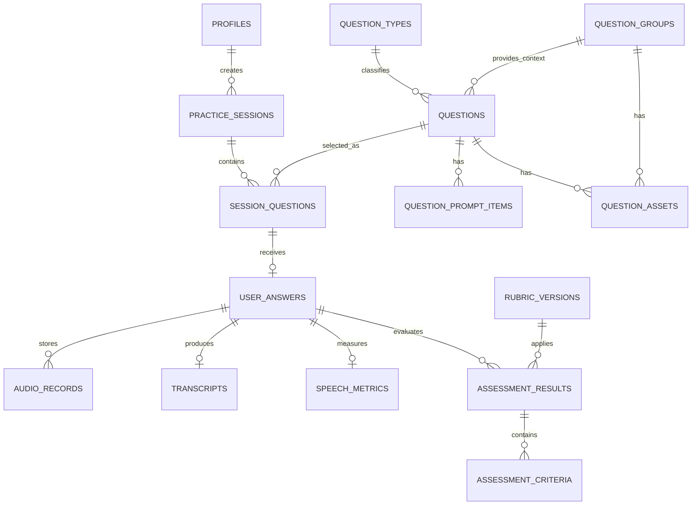

# Speakora — Database Design

## 1. Mục đích tài liệu

Tài liệu mô tả thiết kế cơ sở dữ liệu cho Speakora trong phạm vi MVP và hướng mở rộng cho Mock Test. Thiết kế sử dụng **Supabase PostgreSQL** làm cơ sở dữ liệu chính, **Supabase Auth** để xác thực và **Supabase Storage** để lưu audio, hình ảnh hoặc tài liệu đi kèm câu hỏi.

Mục tiêu của thiết kế:

- biểu diễn đúng format của IELTS Speaking, TOEIC Speaking và General English;
- dùng chung một Question Bank nhưng không trộn lẫn cấu trúc giữa các chế độ;
- lưu audio trước khi xử lý STT/AI;
- truy vết được câu hỏi, rubric, model và prompt đã dùng cho mỗi kết quả;
- hỗ trợ retry mà không tạo bài trả lời hoặc kết quả trùng;
- đủ gọn để triển khai đồ án nhưng vẫn mở rộng được sang Mock Test.

## 2. Lựa chọn công nghệ

| Thành phần | Công nghệ | Vai trò |
| --- | --- | --- |
| Database | Supabase PostgreSQL | Lưu dữ liệu quan hệ, JSONB, trạng thái và lịch sử luyện tập. |
| Authentication | Supabase Auth | Quản lý tài khoản, đăng nhập và định danh người dùng. |
| Object Storage | Supabase Storage | Lưu audio câu hỏi, audio câu trả lời, hình ảnh và tài liệu stimulus. |
| ORM | SQLAlchemy | Truy cập dữ liệu từ FastAPI. |
| Migration | Alembic | Quản lý thay đổi schema theo phiên bản. |

Không lưu binary audio trực tiếp trong PostgreSQL. Database chỉ lưu `storage_bucket`, `storage_path` và metadata. Bucket chứa câu trả lời của người học phải đặt ở chế độ private.

## 3. Nguyên tắc thiết kế

1. Không tạo ba bảng câu hỏi riêng cho IELTS, TOEIC và General English.
2. Không dùng một cột JSONB duy nhất để chứa toàn bộ Question Bank.
3. Các trường thường xuyên lọc, join hoặc kiểm tra ràng buộc phải là cột quan hệ rõ ràng.
4. JSONB chỉ lưu cấu hình khác nhau theo dạng bài hoặc response gốc từ dịch vụ ngoài.
5. Mỗi câu hỏi thuộc đúng một `mode` và một `question_type` tương thích với mode đó.
6. Một tài liệu/ngữ cảnh có thể dùng chung cho nhiều câu hỏi, đặc biệt với TOEIC Speaking.
7. Dữ liệu của phiên luyện phải giữ snapshot cần thiết để việc sửa Question Bank sau này không làm thay đổi lịch sử.
8. Xóa mềm nội dung bằng trạng thái `DRAFT`, `ACTIVE`, `INACTIVE` hoặc `ARCHIVED`; không xóa câu hỏi đã xuất hiện trong lịch sử.
9. Mỗi assessment lưu phiên bản rubric, prompt và model để có thể tái hiện và so sánh kết quả.

## 4. Mô hình dữ liệu tổng thể



## 5. Thiết kế Question Bank

### 5.1. Vì sao không chỉ dùng một bảng `questions`

Format câu hỏi của ba chế độ khác nhau đáng kể:

| Chế độ | Đặc điểm dữ liệu cần biểu diễn |
| --- | --- |
| IELTS Speaking | Part 1 và Part 3 thường gồm nhiều câu theo cùng chủ đề; Part 2 có cue card và các gạch đầu dòng gợi ý. |
| TOEIC Speaking | Có đọc văn bản, mô tả hình ảnh, trả lời câu hỏi, dùng chung tài liệu cung cấp và trình bày ý kiến. Một stimulus có thể phục vụ nhiều câu liên tiếp. |
| General English | Có câu hỏi mở, chủ đề hội thoại và role-play với vai trò, bối cảnh hoặc mục tiêu giao tiếp. |

Vì vậy Question Bank được chia thành các lớp:

- `practice_modes`: chế độ luyện;
- `question_types`: format và quy tắc của dạng bài;
- `topics`: chủ đề nội dung;
- `question_groups`: ngữ cảnh dùng chung cho một nhóm câu;
- `questions`: từng prompt yêu cầu một câu trả lời;
- `question_prompt_items`: các gạch đầu dòng hoặc câu hỏi phụ trong cùng prompt;
- `question_assets`: hình ảnh, văn bản tham chiếu hoặc audio đi kèm.

### 5.2. Bảng `practice_modes`

| Trường | Kiểu | Ràng buộc / Ý nghĩa |
| --- | --- | --- |
| `id` | `uuid` | Khóa chính. |
| `code` | `varchar(30)` | Unique: `IELTS`, `TOEIC`, `GENERAL`. |
| `name` | `varchar(100)` | Tên hiển thị. |
| `description` | `text` | Mô tả chế độ. |
| `is_active` | `boolean` | Cho phép hiển thị và tạo phiên mới. |
| `created_at` | `timestamptz` | Thời điểm tạo. |

### 5.3. Bảng `question_types`

Mỗi bản ghi định nghĩa một format câu hỏi. Thời gian được cấu hình tại đây làm giá trị mặc định; câu hỏi cụ thể có thể override nếu cần.

| Trường | Kiểu | Ràng buộc / Ý nghĩa |
| --- | --- | --- |
| `id` | `uuid` | Khóa chính. |
| `mode_id` | `uuid` | FK → `practice_modes.id`. |
| `code` | `varchar(50)` | Mã ổn định trong hệ thống. |
| `name` | `varchar(150)` | Tên dạng bài. |
| `description` | `text` | Mô tả format. |
| `default_prep_seconds` | `smallint` | Thời gian chuẩn bị mặc định, có thể bằng 0. |
| `default_answer_seconds` | `smallint` | Thời gian trả lời mặc định. |
| `default_replay_limit` | `smallint` | Số lần được nghe/phát lại trong chế độ luyện. |
| `requires_stimulus` | `boolean` | Có bắt buộc tài liệu/hình ảnh/văn bản hay không. |
| `required_asset_types` | `text[]` | Loại asset bắt buộc, ví dụ `IMAGE`, `REFERENCE_TEXT`. |
| `config` | `jsonb` | Cấu hình ít được truy vấn như UI layout hoặc quy tắc timer. |
| `is_active` | `boolean` | Trạng thái sử dụng. |
| `created_at`, `updated_at` | `timestamptz` | Audit time. |

Ràng buộc unique: `unique(mode_id, code)`.

Các mã dạng bài ban đầu:

| Mode | `question_types.code` | Format |
| --- | --- | --- |
| IELTS | `IELTS_PART_1` | Câu hỏi ngắn về chủ đề quen thuộc. |
| IELTS | `IELTS_PART_2_CUE_CARD` | Cue card, chủ đề chính và các gạch đầu dòng. |
| IELTS | `IELTS_PART_3` | Câu hỏi thảo luận sâu liên quan chủ đề Part 2. |
| TOEIC | `TOEIC_READ_ALOUD` | Đọc thành tiếng đoạn văn hiển thị. |
| TOEIC | `TOEIC_DESCRIBE_PICTURE` | Mô tả hình ảnh. |
| TOEIC | `TOEIC_RESPOND_QUESTIONS` | Trả lời câu hỏi ngắn theo tình huống. |
| TOEIC | `TOEIC_RESPOND_USING_INFO` | Trả lời dựa trên tài liệu/thông tin được cung cấp. |
| TOEIC | `TOEIC_EXPRESS_OPINION` | Trình bày và bảo vệ quan điểm. |
| GENERAL | `GENERAL_OPEN_TOPIC` | Nói tự do theo chủ đề. |
| GENERAL | `GENERAL_SITUATIONAL` | Trả lời trong một tình huống giao tiếp. |
| GENERAL | `GENERAL_ROLE_PLAY` | Hội thoại theo vai và mục tiêu giao tiếp. |

Không hard-code thời gian thi trong source code. Thời gian chuẩn bị, trả lời và giới hạn phát lại được seed vào database theo format mà dự án lựa chọn, sau đó có thể điều chỉnh mà không cần sửa schema.

### 5.4. Bảng `topics`

| Trường | Kiểu | Ràng buộc / Ý nghĩa |
| --- | --- | --- |
| `id` | `uuid` | Khóa chính. |
| `mode_id` | `uuid`, nullable | FK → `practice_modes.id`; null nếu dùng chung nhiều mode. |
| `name` | `varchar(120)` | Ví dụ: Education, Travel, Workplace. |
| `slug` | `varchar(140)` | Mã URL/tra cứu, unique theo mode. |
| `description` | `text` | Mô tả chủ đề. |
| `is_active` | `boolean` | Trạng thái. |

### 5.5. Bảng `question_groups`

`question_groups` chứa ngữ cảnh được nhiều câu dùng chung. Ví dụ:

- một chủ đề IELTS Part 1 gồm nhiều câu ngắn;
- một cụm IELTS Part 2–3 có cue card và các câu thảo luận liên quan;
- một lịch biểu TOEIC được dùng chung cho câu 8–10;
- một tình huống General English có nhiều lượt hội thoại.

| Trường | Kiểu | Ràng buộc / Ý nghĩa |
| --- | --- | --- |
| `id` | `uuid` | Khóa chính. |
| `mode_id` | `uuid` | FK → `practice_modes.id`. |
| `topic_id` | `uuid`, nullable | FK → `topics.id`. |
| `code` | `varchar(60)` | Mã quản trị, unique. |
| `group_type` | `varchar(30)` | `TOPIC_SET`, `CUE_CARD_SET`, `STIMULUS_SET`, `SCENARIO`. |
| `title` | `varchar(200)` | Tên nhóm. |
| `shared_context` | `text`, nullable | Bối cảnh dùng chung. |
| `difficulty_level` | `varchar(20)` | `BEGINNER`, `INTERMEDIATE`, `ADVANCED` hoặc mức quy đổi. |
| `status` | `varchar(20)` | `DRAFT`, `ACTIVE`, `INACTIVE`, `ARCHIVED`. |
| `metadata` | `jsonb` | Tag hoặc metadata phụ. |
| `created_by` | `uuid` | FK → `profiles.id`. |
| `created_at`, `updated_at` | `timestamptz` | Audit time. |

### 5.6. Bảng `questions`

Một bản ghi tương ứng với **một prompt cần người học tạo một câu trả lời**. Một câu có thể đứng độc lập hoặc thuộc `question_group`.

| Trường | Kiểu | Ràng buộc / Ý nghĩa |
| --- | --- | --- |
| `id` | `uuid` | Khóa chính. |
| `mode_id` | `uuid` | FK → `practice_modes.id`. |
| `question_type_id` | `uuid` | FK → `question_types.id`. |
| `group_id` | `uuid`, nullable | FK → `question_groups.id`. |
| `topic_id` | `uuid`, nullable | FK → `topics.id`; tiện lọc câu độc lập. |
| `code` | `varchar(80)` | Mã quản trị, unique. |
| `sequence_in_group` | `smallint`, nullable | Thứ tự trong nhóm. |
| `prompt_text` | `text` | Nội dung người học phải trả lời hoặc đọc. |
| `instruction_text` | `text`, nullable | Hướng dẫn thực hiện. |
| `prep_seconds` | `smallint`, nullable | Override thời gian chuẩn bị mặc định. |
| `answer_seconds` | `smallint`, nullable | Override thời gian trả lời mặc định. |
| `replay_limit` | `smallint`, nullable | Override giới hạn phát lại. |
| `difficulty_level` | `varchar(20)` | Mức độ khó. |
| `rubric_version_id` | `uuid` | FK → `rubric_versions.id`. |
| `status` | `varchar(20)` | `DRAFT`, `ACTIVE`, `INACTIVE`, `ARCHIVED`. |
| `version` | `integer` | Phiên bản nội dung câu hỏi. |
| `config` | `jsonb` | Role, mục tiêu giao tiếp, layout hoặc cờ UI đặc thù. |
| `created_by` | `uuid` | FK → `profiles.id`. |
| `created_at`, `updated_at` | `timestamptz` | Audit time. |

Các ràng buộc quan trọng:

- `mode_id` của câu hỏi phải trùng với `mode_id` của `question_type`;
- nếu có `group_id`, mode của group cũng phải trùng với mode câu hỏi;
- `prep_seconds >= 0`, `answer_seconds > 0`, `replay_limit >= 0`;
- chỉ câu có `status = ACTIVE` mới được chọn cho phiên luyện mới;
- câu hỏi đã được sử dụng không update phá vỡ lịch sử; tăng `version` hoặc tạo bản ghi phiên bản mới.

Do PostgreSQL `CHECK` không tham chiếu được bảng khác, các ràng buộc tương thích mode nên được kiểm tra tại service và bảo vệ thêm bằng trigger database.

### 5.7. Bảng `question_prompt_items`

Bảng này lưu các phần tử có thứ tự bên trong một prompt, thay vì nhét mảng vào `questions.prompt_text`.

| Trường | Kiểu | Ràng buộc / Ý nghĩa |
| --- | --- | --- |
| `id` | `uuid` | Khóa chính. |
| `question_id` | `uuid` | FK → `questions.id`, `ON DELETE CASCADE` khi câu chưa sử dụng. |
| `item_type` | `varchar(30)` | `BULLET`, `FOLLOW_UP`, `HINT`, `ROLE_GOAL`. |
| `content` | `text` | Nội dung phần tử. |
| `sequence_no` | `smallint` | Thứ tự hiển thị. |
| `is_required` | `boolean` | Có phải ý bắt buộc trong task hay không. |

Ràng buộc unique: `unique(question_id, sequence_no)`.

Ứng dụng điển hình:

- IELTS Part 2: các bullet “You should say …”;
- General English role-play: mục tiêu giao tiếp hoặc gợi ý;
- TOEIC Express Opinion: các điểm cần đề cập nếu bộ đề có quy định.

### 5.8. Bảng `question_assets`

| Trường | Kiểu | Ràng buộc / Ý nghĩa |
| --- | --- | --- |
| `id` | `uuid` | Khóa chính. |
| `question_id` | `uuid`, nullable | FK → `questions.id`. |
| `group_id` | `uuid`, nullable | FK → `question_groups.id`. |
| `asset_type` | `varchar(30)` | `IMAGE`, `REFERENCE_TEXT`, `QUESTION_AUDIO`, `TTS_AUDIO`. |
| `storage_bucket` | `varchar(100)`, nullable | Bucket nếu asset là file. |
| `storage_path` | `text`, nullable | Object key, không lưu signed URL. |
| `text_content` | `text`, nullable | Nội dung tham chiếu nếu là text. |
| `mime_type` | `varchar(100)`, nullable | MIME type. |
| `alt_text` | `text`, nullable | Mô tả hỗ trợ accessibility. |
| `tts_voice` | `varchar(50)`, nullable | Voice dùng tạo audio. |
| `tts_model` | `varchar(100)`, nullable | Model đã tạo audio. |
| `checksum` | `varchar(128)`, nullable | Phát hiện file trùng và quản lý cache. |
| `sequence_no` | `smallint` | Thứ tự hiển thị/phát. |
| `created_at` | `timestamptz` | Thời điểm tạo. |

Phải có đúng một trong `question_id` hoặc `group_id`. `REFERENCE_TEXT` có thể dùng `text_content`; asset dạng file phải có đủ `storage_bucket` và `storage_path`.

### 5.9. Mapping từng format vào schema

| Format | `question_group` | `question` | `prompt_items` | `assets` |
| --- | --- | --- | --- | --- |
| IELTS Part 1 | Nhóm theo topic | Mỗi câu hỏi ngắn là một record | Thường không cần | Audio TTS tùy chọn |
| IELTS Part 2 | Nhóm cue card/chủ đề | Một cue card là một record | Các bullet “You should say …” | Audio TTS tùy chọn |
| IELTS Part 3 | Có thể dùng chung nhóm với Part 2 | Mỗi câu thảo luận là một record | Follow-up tùy chọn | Audio TTS tùy chọn |
| TOEIC Read Aloud | Có thể đứng độc lập | Đoạn cần đọc nằm trong `prompt_text` | Không cần | Có thể có reference text/audio mẫu ở phần quản trị |
| TOEIC Describe Picture | Có thể đứng độc lập | Lệnh mô tả hình | Không cần | `IMAGE` bắt buộc |
| TOEIC Respond to Questions | Nhóm theo tình huống | Mỗi câu hỏi là một record | Không cần | Question audio/TTS tùy chọn |
| TOEIC Respond Using Information | `STIMULUS_SET` dùng chung | Mỗi câu là một record | Không cần | `REFERENCE_TEXT` hoặc `IMAGE` đặt ở group |
| TOEIC Express Opinion | Có thể đứng độc lập | Câu hỏi quan điểm | Các yêu cầu phụ nếu có | Question audio/TTS tùy chọn |
| General Open Topic | Nhóm theo topic | Một câu hỏi mở | Hint tùy chọn | Audio TTS tùy chọn |
| General Situational/Role-play | `SCENARIO` chứa bối cảnh | Mỗi lượt hoặc nhiệm vụ là một record | Role goal/hint | Hình hoặc audio bối cảnh tùy chọn |

### 5.10. Ví dụ dữ liệu câu hỏi

#### IELTS Part 2

```json
{
  "question_type": "IELTS_PART_2_CUE_CARD",
  "prompt_text": "Describe a skill you would like to learn.",
  "instruction_text": "You should say:",
  "prompt_items": [
    "what the skill is",
    "why you want to learn it",
    "how you would learn it",
    "how this skill would help you"
  ]
}
```

#### TOEIC Respond Using Information

```json
{
  "group_type": "STIMULUS_SET",
  "shared_asset": {
    "asset_type": "REFERENCE_TEXT",
    "text_content": "Workshop schedule ..."
  },
  "questions": [
    { "sequence_in_group": 1, "prompt_text": "When does the workshop begin?" },
    { "sequence_in_group": 2, "prompt_text": "Who will lead the afternoon session?" },
    { "sequence_in_group": 3, "prompt_text": "I heard the venue changed. Is that correct?" }
  ]
}
```

#### General English role-play

```json
{
  "group_type": "SCENARIO",
  "shared_context": "You are calling a hotel to change a reservation.",
  "question_type": "GENERAL_ROLE_PLAY",
  "prompt_text": "Explain the change you need and ask whether there is an extra fee.",
  "config": {
    "learner_role": "hotel guest",
    "system_role": "receptionist"
  }
}
```

## 6. Người dùng và hồ sơ

### 6.1. Supabase `auth.users`

Supabase Auth sở hữu bảng `auth.users`. Ứng dụng không tạo bảng `users` chứa lại password hoặc token.

### 6.2. Bảng `profiles`

| Trường | Kiểu | Ràng buộc / Ý nghĩa |
| --- | --- | --- |
| `id` | `uuid` | PK và FK → `auth.users.id`, `ON DELETE CASCADE`. |
| `display_name` | `varchar(100)` | Tên hiển thị. |
| `role` | `varchar(20)` | `LEARNER`, `ADMIN`. |
| `english_level` | `varchar(30)`, nullable | Trình độ tự khai hoặc đã đánh giá. |
| `target_mode` | `varchar(30)`, nullable | Mục tiêu chính. |
| `timezone` | `varchar(50)` | Múi giờ người dùng. |
| `created_at`, `updated_at` | `timestamptz` | Audit time. |

Khảo sát sở thích và lộ trình cá nhân hóa chưa thuộc MVP; khi triển khai có thể thêm `user_goals`, `user_interests` thay vì tiếp tục mở rộng `profiles` bằng nhiều cột nullable.

## 7. Rubric và phiên bản chấm

### 7.1. Bảng `rubrics`

| Trường | Kiểu | Ý nghĩa |
| --- | --- | --- |
| `id` | `uuid` | Khóa chính. |
| `mode_id` | `uuid` | FK → `practice_modes.id`. |
| `question_type_id` | `uuid`, nullable | Null nếu áp dụng chung mode; có giá trị nếu riêng dạng bài. |
| `name` | `varchar(150)` | Tên rubric. |
| `status` | `varchar(20)` | `DRAFT`, `ACTIVE`, `ARCHIVED`. |
| `created_at` | `timestamptz` | Thời điểm tạo. |

### 7.2. Bảng `rubric_versions`

| Trường | Kiểu | Ý nghĩa |
| --- | --- | --- |
| `id` | `uuid` | Khóa chính. |
| `rubric_id` | `uuid` | FK → `rubrics.id`. |
| `version_no` | `integer` | Phiên bản tăng dần. |
| `criteria_schema` | `jsonb` | Tiêu chí, thang điểm, trọng số và mô tả mức điểm. |
| `output_schema` | `jsonb` | JSON Schema cho kết quả AI. |
| `prompt_template` | `text` | Prompt chấm của phiên bản. |
| `is_published` | `boolean` | Chỉ version đã publish được dùng cho phiên mới. |
| `created_by` | `uuid` | FK → `profiles.id`. |
| `created_at` | `timestamptz` | Thời điểm tạo. |

Ràng buộc unique: `unique(rubric_id, version_no)`.

Không update trực tiếp version đã dùng để chấm. Khi đổi tiêu chí hoặc prompt, tạo `rubric_version` mới.

## 8. Phiên luyện và câu hỏi trong phiên

### 8.1. Bảng `practice_sessions`

| Trường | Kiểu | Ý nghĩa |
| --- | --- | --- |
| `id` | `uuid` | Khóa chính. |
| `user_id` | `uuid` | FK → `profiles.id`. |
| `mode_id` | `uuid` | FK → `practice_modes.id`. |
| `session_type` | `varchar(20)` | `PRACTICE`, `MOCK_TEST`. |
| `status` | `varchar(20)` | `READY`, `IN_PROGRESS`, `PROCESSING`, `COMPLETED`, `ABANDONED`. |
| `started_at`, `completed_at` | `timestamptz`, nullable | Thời gian phiên. |
| `created_at` | `timestamptz` | Thời điểm tạo. |

### 8.2. Bảng `session_questions`

Bảng liên kết giữ thứ tự câu trong phiên và snapshot cấu hình tại thời điểm chọn câu.

| Trường | Kiểu | Ý nghĩa |
| --- | --- | --- |
| `id` | `uuid` | Khóa chính. |
| `session_id` | `uuid` | FK → `practice_sessions.id`. |
| `question_id` | `uuid` | FK → `questions.id`. |
| `sequence_no` | `smallint` | Thứ tự trong phiên. |
| `question_version` | `integer` | Version câu hỏi lúc được chọn. |
| `rubric_version_id` | `uuid` | Rubric được khóa cho lượt này. |
| `prompt_snapshot` | `jsonb` | Prompt, instruction, prompt items và asset references cần thiết. |
| `prep_seconds` | `smallint` | Thời gian thực tế của lượt. |
| `answer_seconds` | `smallint` | Thời gian thực tế của lượt. |
| `created_at` | `timestamptz` | Thời điểm thêm vào phiên. |

Ràng buộc:

- `unique(session_id, sequence_no)`;
- `unique(session_id, question_id)` trong phiên luyện thông thường;
- mode của session phải tương thích với mode câu hỏi.

`prompt_snapshot` có chủ đích: nếu quản trị viên sửa wording hoặc asset của câu hỏi, lịch sử vẫn hiển thị đúng nội dung người học đã nhận.

## 9. Bài trả lời, audio và transcript

### 9.1. Bảng `user_answers`

| Trường | Kiểu | Ý nghĩa |
| --- | --- | --- |
| `id` | `uuid` | Khóa chính. |
| `session_question_id` | `uuid` | FK → `session_questions.id`. |
| `user_id` | `uuid` | FK → `profiles.id`, hỗ trợ RLS và truy vấn nhanh. |
| `status` | `varchar(30)` | `UPLOADED`, `TRANSCRIBING`, `ANALYZING`, `ASSESSING`, `COMPLETED`, `NEEDS_RETRY`. |
| `idempotency_key` | `uuid` | Unique theo user để chống submit trùng. |
| `attempt_no` | `smallint` | Lần trả lời thứ mấy trong chế độ luyện. |
| `error_code` | `varchar(60)`, nullable | Mã lỗi cuối cùng. |
| `error_message` | `text`, nullable | Thông báo an toàn để debug/hiển thị. |
| `submitted_at`, `completed_at` | `timestamptz`, nullable | Mốc xử lý. |
| `created_at`, `updated_at` | `timestamptz` | Audit time. |

Ràng buộc `unique(user_id, idempotency_key)`.

### 9.2. Bảng `audio_records`

| Trường | Kiểu | Ý nghĩa |
| --- | --- | --- |
| `id` | `uuid` | Khóa chính. |
| `answer_id` | `uuid` | FK → `user_answers.id`. |
| `storage_bucket` | `varchar(100)` | Bucket private. |
| `storage_path` | `text` | Object key ổn định. |
| `mime_type` | `varchar(100)` | Ví dụ `audio/webm`. |
| `file_size_bytes` | `bigint` | Kích thước file. |
| `duration_ms` | `integer` | Thời lượng. |
| `checksum` | `varchar(128)`, nullable | Kiểm tra toàn vẹn/trùng file. |
| `is_selected` | `boolean` | Bản audio được dùng để chấm. |
| `created_at` | `timestamptz` | Thời điểm upload. |

Không lưu signed URL vì URL này hết hạn. Backend sinh URL có thời hạn từ `storage_path` khi người dùng hợp lệ cần truy cập.

### 9.3. Bảng `transcripts`

| Trường | Kiểu | Ý nghĩa |
| --- | --- | --- |
| `id` | `uuid` | Khóa chính. |
| `answer_id` | `uuid` | FK → `user_answers.id`, unique. |
| `text` | `text` | Transcript gốc từ STT. |
| `language` | `varchar(10)` | Mặc định `en`. |
| `provider` | `varchar(50)` | Nhà cung cấp STT. |
| `model` | `varchar(100)` | Model STT. |
| `segments` | `jsonb`, nullable | Timestamp/segment nếu provider hỗ trợ. |
| `provider_metadata` | `jsonb`, nullable | Metadata cần thiết, đã loại dữ liệu nhạy cảm. |
| `confidence` | `numeric(5,4)`, nullable | Chỉ lưu nếu provider thực sự cung cấp. |
| `created_at` | `timestamptz` | Thời điểm tạo. |

Không dùng LLM sửa transcript gốc trước khi chấm. Nếu sau này có transcript đã hiệu chỉnh, lưu ở bảng/field riêng và vẫn giữ bản gốc.

### 9.4. Bảng `speech_metrics`

| Trường | Kiểu | Ý nghĩa |
| --- | --- | --- |
| `id` | `uuid` | Khóa chính. |
| `answer_id` | `uuid` | FK → `user_answers.id`, unique. |
| `duration_ms` | `integer` | Thời lượng audio. |
| `word_count` | `integer` | Số từ transcript. |
| `words_per_minute` | `numeric(7,2)`, nullable | Tốc độ nói ước tính. |
| `speech_ratio` | `numeric(5,4)`, nullable | Tỷ lệ thời gian có tiếng nói. |
| `pause_count` | `integer`, nullable | Số khoảng ngừng khi đủ timestamp. |
| `total_pause_ms` | `integer`, nullable | Tổng thời gian ngừng. |
| `quality_flags` | `jsonb` | Ví dụ `LOW_VOLUME`, `TOO_SHORT`, `HIGH_NOISE`. |
| `analyzer_version` | `varchar(50)` | Phiên bản logic phân tích. |
| `created_at` | `timestamptz` | Thời điểm tạo. |

## 10. Kết quả đánh giá

### 10.1. Bảng `assessment_results`

Mỗi lần chấm/retry tạo một assessment riêng. Chỉ một record được đánh dấu là kết quả hiện hành.

| Trường | Kiểu | Ý nghĩa |
| --- | --- | --- |
| `id` | `uuid` | Khóa chính. |
| `answer_id` | `uuid` | FK → `user_answers.id`. |
| `rubric_version_id` | `uuid` | FK → `rubric_versions.id`. |
| `attempt_no` | `smallint` | Lần gọi assessment. |
| `status` | `varchar(20)` | `PENDING`, `VALID`, `INVALID`, `FAILED`. |
| `overall_score` | `numeric(6,2)`, nullable | Điểm tổng đã kiểm tra phạm vi. |
| `score_scale` | `varchar(30)` | Ví dụ `IELTS_BAND`, `TOEIC_INTERNAL`, `PERCENT_100`. |
| `strengths` | `jsonb` | Danh sách điểm mạnh. |
| `improvements` | `jsonb` | Lỗi và hành động cải thiện. |
| `raw_output` | `jsonb` | Structured Output hợp lệ hoặc dữ liệu phục vụ debug có kiểm soát. |
| `provider` | `varchar(50)` | Provider LLM. |
| `model` | `varchar(100)` | Model đã chấm. |
| `prompt_version` | `varchar(50)` | Phiên bản prompt/gateway. |
| `input_tokens`, `output_tokens` | `integer`, nullable | Token usage. |
| `latency_ms` | `integer`, nullable | Độ trễ. |
| `estimated_cost_usd` | `numeric(12,6)`, nullable | Chi phí ước tính. |
| `is_current` | `boolean` | Kết quả đang hiển thị. |
| `created_at` | `timestamptz` | Thời điểm tạo. |

Ràng buộc:

- `unique(answer_id, attempt_no)`;
- partial unique index bảo đảm mỗi `answer_id` chỉ có một record `is_current = true`;
- chỉ assessment `VALID` mới được đánh dấu `is_current` và công bố cho người học.

### 10.2. Bảng `assessment_criteria`

| Trường | Kiểu | Ý nghĩa |
| --- | --- | --- |
| `id` | `uuid` | Khóa chính. |
| `assessment_result_id` | `uuid` | FK → `assessment_results.id`. |
| `criterion_code` | `varchar(60)` | Ví dụ `FLUENCY`, `GRAMMAR`, `TASK_FULFILLMENT`. |
| `criterion_name` | `varchar(120)` | Tên hiển thị. |
| `score` | `numeric(6,2)` | Điểm tiêu chí. |
| `max_score` | `numeric(6,2)` | Điểm tối đa. |
| `feedback` | `text` | Nhận xét. |
| `evidence` | `jsonb`, nullable | Đoạn transcript hoặc dữ liệu đo hỗ trợ nhận xét. |
| `sequence_no` | `smallint` | Thứ tự hiển thị. |

Ràng buộc unique: `unique(assessment_result_id, criterion_code)`.

Việc tách tiêu chí thành bảng giúp truy vấn tiến bộ theo từng kỹ năng. `raw_output` vẫn được giữ để audit, nhưng dashboard không phải phân tích toàn bộ JSONB mỗi lần.

## 11. Tác vụ nền và retry

Nếu MVP dùng Redis/Celery, Redis giữ queue tạm thời còn PostgreSQL vẫn lưu trạng thái nghiệp vụ. Có thể bổ sung bảng `processing_jobs` để audit:

| Trường | Kiểu | Ý nghĩa |
| --- | --- | --- |
| `id` | `uuid` | Khóa chính. |
| `answer_id` | `uuid` | FK → `user_answers.id`. |
| `job_type` | `varchar(30)` | `STT`, `ANALYSIS`, `ASSESSMENT`. |
| `status` | `varchar(20)` | `QUEUED`, `RUNNING`, `SUCCEEDED`, `FAILED`, `RETRYING`. |
| `attempt_count` | `smallint` | Số lần đã chạy. |
| `max_attempts` | `smallint` | Giới hạn retry. |
| `external_request_id` | `varchar(150)`, nullable | ID từ provider/queue nếu có. |
| `error_code`, `error_message` | `text`, nullable | Thông tin lỗi đã làm sạch. |
| `started_at`, `finished_at`, `next_retry_at` | `timestamptz`, nullable | Mốc xử lý. |
| `created_at`, `updated_at` | `timestamptz` | Audit time. |

Unique có điều kiện nên ngăn hai job `QUEUED/RUNNING` cùng `answer_id + job_type`.

## 12. Tiến bộ học tập

Trong MVP, lịch sử và biểu đồ tiến bộ có thể tính trực tiếp từ:

`practice_sessions → user_answers → assessment_results → assessment_criteria`

Chưa cần bảng `learning_progress` cập nhật sau mỗi lượt vì dễ tạo dữ liệu tổng hợp lệch với dữ liệu gốc. Khi dữ liệu lớn hơn, dùng materialized view hoặc bảng snapshot theo ngày:

- `user_id`;
- `mode_id`;
- `criterion_code`;
- `period_date`;
- `attempt_count`;
- `average_score`;
- `average_wpm`;
- `updated_at`.

## 13. Mock Test

Mock Test là phần cuối MVP hoặc giai đoạn kế tiếp. Các bảng mở rộng đề xuất:

### 13.1. `test_templates`

Lưu tên bài thi, mode, phiên bản, trạng thái và cấu trúc tổng thể.

### 13.2. `test_template_sections`

Lưu Part/dạng bài, thứ tự section và quy tắc số lượng câu.

### 13.3. `test_template_items`

Liên kết template với `question_id` hoặc quy tắc chọn question group, giữ đúng thứ tự bài thi.

Khi bắt đầu Mock Test, hệ thống vẫn tạo `practice_sessions` và `session_questions`. Template chỉ là khuôn; `session_questions` là snapshot đề thực tế của người học.

## 14. Index đề xuất

| Index | Mục đích |
| --- | --- |
| `questions(mode_id, question_type_id, status, difficulty_level)` | Chọn câu hỏi phù hợp. |
| `questions(group_id, sequence_in_group)` | Lấy câu theo nhóm đúng thứ tự. |
| `question_groups(mode_id, topic_id, status)` | Lọc bộ câu/chủ đề. |
| `session_questions(session_id, sequence_no)` | Điều phối phiên. |
| `practice_sessions(user_id, created_at desc)` | Lịch sử người học. |
| `user_answers(user_id, status, created_at desc)` | Lịch sử và job đang xử lý. |
| `assessment_results(answer_id, created_at desc)` | Lấy kết quả và các lần retry. |
| `assessment_criteria(criterion_code, assessment_result_id)` | Tổng hợp tiến bộ theo tiêu chí. |
| `processing_jobs(status, next_retry_at)` | Worker lấy job cần chạy/retry. |

Có thể thêm GIN index cho `questions.config`, `question_groups.metadata` hoặc full-text search khi có nhu cầu truy vấn thực tế; không tạo trước nếu chưa có query sử dụng.

## 15. Row Level Security và quyền truy cập

RLS phải bật cho mọi bảng chứa dữ liệu người dùng.

| Nhóm bảng | Người học | Quản trị viên / Backend |
| --- | --- | --- |
| `profiles` | Chỉ đọc/sửa hồ sơ của mình. | Quản lý theo role phù hợp. |
| `practice_sessions`, `session_questions` | Chỉ truy cập session thuộc mình. | Backend tạo và điều phối. |
| `user_answers`, `audio_records`, `transcripts`, `speech_metrics` | Chỉ truy cập dữ liệu của mình. | Worker dùng service role ở server. |
| `assessment_results`, `assessment_criteria` | Chỉ đọc kết quả của mình; không tự ghi điểm. | Backend/worker tạo và cập nhật. |
| Question Bank đang `ACTIVE` | Người học chỉ đọc qua API/view cần thiết. | Admin có quyền CRUD và publish. |
| Rubric/prompt nội bộ | Không truy cập trực tiếp. | Backend/worker và admin được cấp quyền. |

Frontend không được giữ Supabase service role key. Signed URL của audio phải có thời hạn ngắn và chỉ sinh sau khi kiểm tra quyền sở hữu.

## 16. Quy tắc transaction và tính nhất quán

### 16.1. Tạo phiên luyện

Trong một transaction:

1. tạo `practice_session`;
2. chọn câu hỏi `ACTIVE` đúng mode/type;
3. khóa `question_version` và `rubric_version_id`;
4. tạo `session_questions` cùng `prompt_snapshot`.

### 16.2. Xác nhận nộp audio

Trong một transaction:

1. kiểm tra object đã tồn tại trong Storage;
2. tạo hoặc xác nhận `audio_record`;
3. tạo `user_answer` bằng `idempotency_key`;
4. đánh dấu audio được chọn;
5. tạo job STT hoặc phát sự kiện cho queue.

Nếu request được gửi lại với cùng `idempotency_key`, API trả về `answer_id` cũ thay vì tạo dữ liệu mới.

### 16.3. Công bố assessment

Trong một transaction:

1. lưu structured output đã qua schema validation;
2. lưu từng `assessment_criteria`;
3. bỏ `is_current` khỏi kết quả cũ;
4. đặt kết quả mới hợp lệ thành `is_current = true`;
5. cập nhật `user_answers.status = COMPLETED`.

## 17. Quy ước chung

- Khóa chính dùng UUID, ưu tiên `gen_random_uuid()`.
- Thời gian dùng `timestamptz` và lưu theo UTC.
- Tên bảng/cột dùng `snake_case`.
- Mọi bảng nghiệp vụ có `created_at`; bảng có thể sửa thêm `updated_at`.
- `updated_at` được cập nhật bằng trigger hoặc application layer thống nhất.
- Enum ổn định có thể dùng PostgreSQL enum; trạng thái còn thay đổi ở giai đoạn thiết kế có thể dùng `varchar + CHECK` để migration dễ hơn.
- Foreign key lịch sử ưu tiên `RESTRICT` hoặc xóa mềm; chỉ dùng `CASCADE` cho dữ liệu con không có ý nghĩa độc lập.
- Không ghi API key, access token, chain-of-thought hoặc signed URL vào database/log.

## 18. Phạm vi triển khai theo giai đoạn

### MVP bắt buộc

- `profiles`;
- `practice_modes`, `question_types`, `topics`;
- `question_groups`, `questions`, `question_prompt_items`, `question_assets`;
- `rubrics`, `rubric_versions`;
- `practice_sessions`, `session_questions`;
- `user_answers`, `audio_records`, `transcripts`, `speech_metrics`;
- `assessment_results`, `assessment_criteria`;
- RLS, index chính và idempotency.

### Có thể bổ sung sau

- `processing_jobs` nếu cần audit job trong PostgreSQL;
- `test_templates` và các bảng Mock Test;
- materialized view tiến bộ;
- khảo sát sở thích, lộ trình học và gamification;
- pgvector cho tìm kiếm ngữ nghĩa hoặc cá nhân hóa khi có use case rõ ràng.

## 19. Điều kiện hoàn thành thiết kế database

- Question Bank biểu diễn được đầy đủ các format đã chọn của IELTS, TOEIC và General English.
- TOEIC có thể gắn một stimulus cho nhiều câu; IELTS Part 2 có cue card và bullet prompts.
- Một phiên khóa được nội dung câu hỏi và rubric đã dùng.
- Audio được lưu riêng trong Storage và liên kết đúng với người dùng/lượt trả lời.
- Transcript gốc, chỉ số đo và kết quả AI được tách rõ.
- Retry không ghi đè mất kết quả cũ và không tạo submit trùng.
- Người học chỉ truy cập được dữ liệu của chính mình.
- Có thể truy vấn lịch sử và tiến bộ theo từng tiêu chí chấm.
- Schema đủ cho pipeline trong `03-main-pipeline.md` và kiến trúc trong `04-system-architecture.md`.
