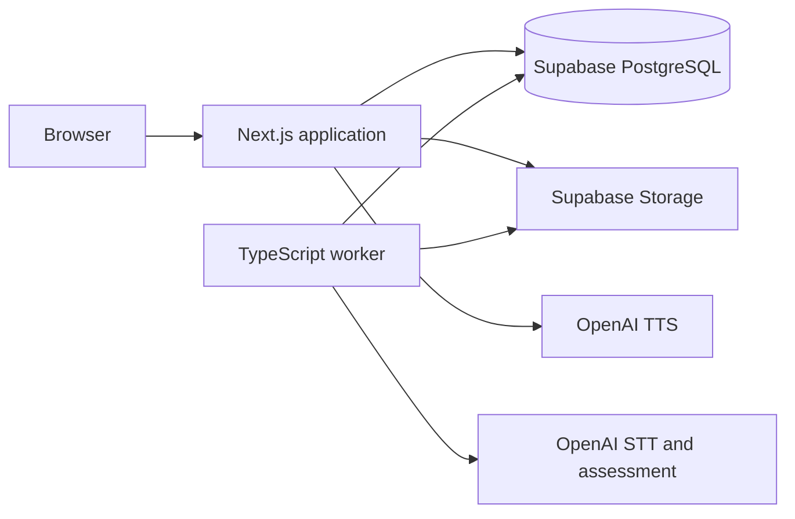

# Current Architecture Overview

## System Shape

Speakora is currently a TypeScript modular monolith with two runtime processes:



- The Next.js 15 App Router application serves the UI and HTTP APIs.
- Supabase PostgreSQL stores the question bank, practice sessions, answers, transcripts, jobs, and assessments.
- The private `speaking-answers` Supabase Storage bucket stores recorded answers.
- A long-running Node.js worker claims durable jobs from PostgreSQL and performs STT and assessment.
- OpenAI calls are server-side and accessed through a shared provider abstraction.

There is no separate FastAPI service, Redis queue, or Python worker in the implemented repository.

## Entry Points

| Path | Responsibility |
| --- | --- |
| `src/app/page.tsx` | Redirects the root route to the speech practice UI. |
| `src/app/demo/speech/page.tsx` | Client-side five-question practice state machine, recording, upload, polling, and results. |
| `src/app/api/practice/sessions/route.ts` | Creates an IELTS guest session and fixed question snapshot. |
| `src/app/api/practice/sessions/[sessionId]/` | Uploads answers, returns status/results, and retries failed jobs. |
| `src/app/api/speech/tts/route.ts` | Authorizes a session question and returns generated question audio. |
| `src/app/api/questions/random/route.ts` | Legacy/demo random-question endpoint supporting IELTS, TOEIC, and General modes. |
| `src/app/api/demo/speech/route.ts` | Legacy synchronous TTS/STT demo endpoint. It is not used by the five-question background flow. |
| `src/worker/index.ts` | Polling worker for `STT` and `ASSESSMENT` jobs. |

## Module Boundaries

- `src/modules/practice/`: guest-token handling, shared DTOs, session authorization, and Supabase repositories.
- `src/modules/audio/`: upload size and MIME validation.
- `src/modules/ai-gateway/`: `TextToSpeechProvider`, `SpeechToTextProvider`, `AssessmentProvider`, and the OpenAI implementation.
- `src/lib/supabase/`: validates server environment and constructs public/admin Supabase clients.
- `supabase/migrations/`: creates the implemented schema, Storage bucket, RPC transactions, RLS, and job-claiming function.

Route handlers validate transport input and delegate shared operations to these modules. The worker reuses the AI gateway but creates its own service-role Supabase client because it runs outside Next.js.

## Runtime and Deployment

Run the web application and worker as separate long-running processes from the same repository:

```powershell
npm run dev
npm run worker
```

Production requires applying all SQL migrations, configuring server-only environment variables, deploying Next.js, and keeping at least one worker process alive. The browser requires localhost or HTTPS for microphone access.

## Current Scope

Implemented scope is an unauthenticated guest IELTS session with five random fixed questions, automatic TTS, recorded-answer uploads, background transcription, one session-level assessment, polling, and retry. Accounts, history, progress analytics, pronunciation assessment, realtime transcription, adaptive questions, TOEIC sessions, and General English sessions remain future work.
